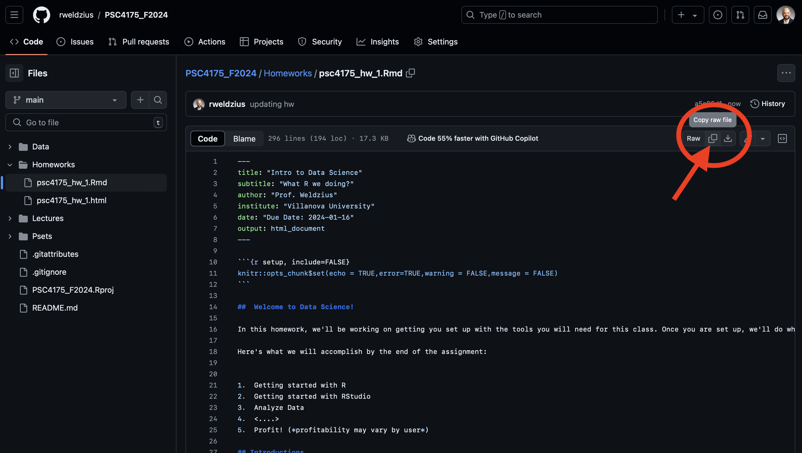
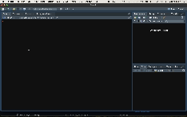

```{r setup, include=FALSE}
knitr::opts_chunk$set(echo = TRUE,error=TRUE,warning = FALSE,message = FALSE)
```

##  Welcome to your introduction to quantitative methods!

In this homework, we'll be working on getting you set up with the tools you will need for this class. Once you are set up, we'll do what we're here to do: analyze data!

Here's what we will accomplish by the end of the assignment:
 
1.  Getting started with R
2.  Getting started with RStudio
3.  Analyze Data
4.  <....>
5.  Profit! (*profitability may vary by user*)

## Introductions

We need two basic sets of tools for this class. We will need `R` to analyze data. We will need `RStudio` to help us interface with R and to produce documentation of our results.

## Installing R

R is going to be the only programming language we will use. R is an extensible statistical programming environment that can handle all of the main tasks that we'll need to cover this semester: getting data, analyzing data and communicating data analysis.

If you haven't already, you need to download R here: <https://cran.r-project.org/>.

## Installing RStudio

When we work with R, we communicate via the command line. To help automate this process, we can write scripts, which contain all of the commands to be executed. These scripts generate various kinds of output, like numbers on the screen, graphics or reports in common formats (pdf, word). Most programming languages have several **I**ntegrated **D**evelopment **E**nvironments (IDEs) that encompass all of these elements (scripts, command line interface, output). The primary IDE for R is RStudio.

If you haven't already, you need to download RStudio here: <https://rstudio.com/products/rstudio/download/>. You need the free RStudio desktop version.


## Accessing Files and Using Directories

In each class, we're going to include some code and text in one file, and data in another file. You'll need to download both of these files to your computer. You need to have a particular place to put these files. Computers are organized using named directories (sometimes called folders).  Don't just put the files in your Downloads directory. One common solution is to created a directory on your computer named after the class: `psc_4175`. Each time you access the files, you'll want to place them in that directory.  

## Yes We Code! Running R Code

 We're going to grab some data that's part of the [college scorecard](https://collegescorecard.ed.gov/data/documentation/) and do a bit of analysis on it.

## .Rmd Set Up

Open `RStudio`, then create a new `.Rmd` file. To do this, click on `File` &rarr; `New File` &rarr; `R Markdown...`.

<center></center>

You will then be asked to determine a bunch of settings for this `.Rmd` document. For example, you can choose whether you want to create a "Document", "Presentation", "Shiny", or "From Template" on the left. You can set the "Title:" "Author:" and "Date:" on the top-right. And you can choose the "Default Output Format:" to be either "HTML", "PDF", or "Word". You should **not change any of these settings**. Their defaults ("Document", "Untitled", "[Your name]", "[Today's Date]", and "HTML") are sufficient. Just click "OK".

<center></center>

Copy the raw code from the [`psc7000_hw_1.Rmd`](https://github.com/rweldzius/PSC7000_F2024/blob/main/Homeworks/psc7000_hw_1.Rmd) file by clicking on the copy button as shown in the image below.

<center></center>

Finally, replace the default code in your R Markdown file with the copied code from the GitHub!

If viewing this as an html file, you can view this gif for more help!

<center></center>

## .Rmd Files
.Rmd files will be the only file format we work in this class. .Rmd files contain three basic elements:

1.  Script that can be interpreted by R.
2.  Output generated by R, including tables and figures.  
3.  Text that can be read by humans.

From a .Rmd file you can generate html documents, pdf documents, word documents, slides . . . lots of stuff. All class notes will be in .Rmd. Most assignments will be turned in as .Rmd files, and the guided exercise we'll have you do? You guessed it, .Rmd.

In the `.Rmd` file you'll notice that there are three open single quotes in a row, like so: ```` ``` ```` This indicates the start of a "code chunk" in our file. The first code chunk that we load will include a set of programs that we will need all semester long.

## Outputting results

I like to see results in the Console. By default Rstudio will output results from an Rmd file inline-- meaning in the document itself. To change this, go to Tools-->global Options-->R Markdown, and uncheck the box for "show output inline for all Rmarkdown documents."


## Using R Libraries

When we say that R is extensible, we mean that people in the community can write programs that everyone else can use. These are called "packages." In these first few lines of code, I load a set of packages using the library command in R. The set of packages, called `tidyverse` were written by Hadley Wickham and others and play a key role in his book. To install this set of packages, simply type in `install.packages("tidyverse")` at the R command prompt. Alternatively, you can use the "Packages" pane in the lower right hand corner of your Rstudio screen. Click on Packages, then click on install, then type in "tidyverse."

To run the code below in R, you can:

-   Press the "play" button next to the code chunk
-   In OS X, place the cursor in the code chunk and hit `CMD+RETURN`
-   In Windows, place the cursor in the code chunk and hit `CTRL+RETURN`

```{r, message=FALSE}
## Get necessary libraries-- won't work the first time, because you need to install them!
# install.packages("tidyverse")  # Uncomment this to install
library(tidyverse)
```

Here's the thing about packages. There's a difference between *installing* a package and *calling* a package. *Installing* means that the package is on your computer and available to use. *Calling* a package means that the commands in the package will be used in this session. A "session" is basically when R has been opened up on your computer. As long as R/Rstudio are open and running, the session is active. 

It's a good practice to shutdown R/Rstudio once you're no longer working on it, and then to restart it when you begin working again. Otherwise, the working environment can get pretty crowded with data and packages. 

## Loading Datasets

Now we're ready to load in data. The data frame will be our basic way of interacting with everything in this class. The `sc_debt.Rds` (found here:
https://github.com/rweldzius/PSC7000_F2024/blob/main/Data/sc_debt.Rds) data frame contains information from the college scorecard on different colleges and universities.

`tidyverse` includes a `read_rds()` function that can read data directly from the internet.

```{r}
df <- read_rds('https://github.com/rweldzius/PSC7000_F2024/raw/main/Data/sc_debt.Rds')
```

You'll notice that the code above starts with `df`. This is just an arbitrary name for an object. You could name it `dat` or `raw` or `debt` or whatever you want. Then there's an arrow `<-`. This is an assignment operator. Then there's a  function, `readRDS`, with parentheses, and an argument "sc_debt.Rds". Here's how to think about this.

- Functions in R always have arguments within parentheses. This function. `readRDS` opens a type of data-- rds data. This function has one argument which is the name of the file I want to open. 
- Assignment operators take the result of a function and assign it to an object name.
- Objects in R store information locally so that it can be accessed again. 

So the command above says "use `readRDS` to open the file "sc_debt.Rds" and assign the result to the object `df`. 

Let's take a quick look at the object `df`

```{r}
df
```

This is just the first part of the data frame. All data frames have the exact same structure. Each row is a case. In this example, each row is a college. Each column is a characteristics of the case, what we call a variable. Let's use the `names` command to see what variables are in the dataset. 


```{r}
names(df)
```

It's hard to know what these mean without some more information. We usually use a codebook to get more information about a dataset. Because we use very short names for variables, it's useful to have some more information (fancy name: metadata) that tells us about those variables. Below you'll see the `R` name for each variable next to a description of each variable. 


| Name           | Definition                                                                                                                                                                                             |
|----------------|--------------------------------------------------------------------------------------------------------------------------------------------------------------------------------------------------------|
| unitid         | Unit ID                                                                                                                                                                                                |
| instnm         | Institution Name                                                                                                                                                                                       |
| stabbr         | State Abbreviation                                                                                                                                                                                     |
| grad_debt_mdn  | Median Debt of Graduates                                                                                                                                                                               |
| control        | Control Public or Private                                                                                                                                                                              |
| region         | Census Region                                                                                                                                                                                          |
| preddeg        | Predominant Degree Offered: Associates or Bachelors                                                                                                                                                    |
| openadmp       | Open Admissions Policy: 1= Yes, 2=No,3=No 1st time students                                                                                                                                            |
| adm_rate       | Admissions Rate: proportion of applications accepted                                                                                                                                                   |
| ccbasic        | Type of institution-- see [here](https://data.ed.gov/dataset/9dc70e6b-8426-4d71-b9d5-70ce6094a3f4/resource/658b5b83-ac9f-4e41-913e-9ba9411d7967/download/collegescorecarddatadictionary_01192021.xlsx) |
| selective      | Institution admits fewer than 10 % of applicants, 1=Yes, 0=No                                                                                                                                          |
| research_u     | Institution is a research university 1=Yes, 0=No                                                                                                                                                      |
| sat_avg        | Average Sat Scores                                                                                                                                                                                     |
| md_earn_wne_p6 | Average Earnings of Recent Graduates                                                                                                                                                                   |
|ugds  | Number of undergraduates |
| costt4a | Average cost of attendance (tuition-grants) |

## Looking at datasets

We can also look at the whole dataset using View. Just delete the `#` sign below to make the code work. That `#` sign is a comment in R code, which indicates to the computer that everything on that line should be ignored. To get it to run, we need to drop the `#`. 

```{r, eval=FALSE}
#View(df)
```

You'll notice that this data is arranged in a rectangular format, with each row showing a different college, and each column representing a different characteristic of that college. Datasets are always structured this way--- cases (or units) will form the rows, and the characteristics of those cases-- or variables--- will form the columns. Unlike working with spreadsheets, this structure is always assumed for datasets.

## Filter, Select, Arrange

In exploring data, many times we want to look at smaller parts of the dataset. There are three commands we'll use today that help with this.

\-`filter` selects only those cases or rows that meet some logical criteria.

\-`select` selects only those variables or columns that meet some criteria

\-`arrange` arranges the rows of a dataset in the way we want.

For more on these, please see this [vignette](https://cran.rstudio.com/web/packages/dplyr/vignettes/introduction.html).

Let's grab just the data for Villanova, then look only at the average test scores and admit rate. We can use filter to look at all of the variables for Villanova:

```{r filter_select_arrange}
df%>%
  filter(instnm=="Villanova University")
```

What's that weird looking `%>%` thing? That's called a pipe. This is how we chain commands together in R. Think of it as saying "and then" to R. In the above case, we said, take the data *and then* filter it to be just the data where the institution name is Villanova University.

The command above says the following:

Take the dataframe `df` _and then_ filter it to just those cases where `instnm` is equal to "Villanova University." Notice the "double equals" sign, that's a logical operator asking if `instnm` is equal to "Villanova University."

Many times, though we don't want to see everything, we just want to choose a few variables. `select` allows us to select only the variables we want. In this case, the institution name, its admit rate, and the average SAT scores of entering students.

```{r}
df%>%
  filter(instnm=="Villanova University")%>%
  select(instnm,adm_rate,sat_avg)
```

`filter` takes logical tests as its argument. The code `insntnm=="Villanova University"` is a logical statement that will be true of just one case in the dataset-- when institution name is Villanova University. The `==` is a logical test, asking if this is equal to that. Other common logical and relational operators for R include

-   `>`, `<`: greater than, less than
-   `>=`, `<=`: greater than or equal to, less than or equal to
-   `!` :not, as in `!=` not equal to
-   `&` AND
-   `|` OR

Next, we can use `filter` to look at colleges with low admissions rates, say less than 10% ( or .1 in the proportion scale used in the dataset).

```{r}
df%>%
  filter(adm_rate<.1)%>%
  select(instnm,adm_rate,sat_avg)%>%
  arrange(sat_avg,adm_rate)%>%
  print(n=20)
```

Now let's look at colleges with low admit rates, and order them using `arrange` by SAT scores (`-sat_avg` gives descending order).

```{r}
df%>%
  filter(adm_rate<.1)%>%
  select(instnm,adm_rate,sat_avg)%>%
  arrange(-sat_avg)
```

And one last operation: all colleges that admit between 20 and 30 percent of students, looking at their SAT scores, earnings of attendees six years letter, and what state they are in, then arranging by state, and then SAT score.

```{r}
df%>%
  filter(adm_rate>.2&adm_rate<.3)%>%
  select(instnm,sat_avg,md_earn_wne_p6,stabbr)%>%
  arrange(stabbr,-sat_avg)%>%
  print(n=40)
```

*Quick Exercise* Choose a different college and two different things about that college. Have R print the output.

```{r}
# INSERT CODE HERE
```

## Summarizing Data

To summarize data, we use the `summarize` command. Inside that command, we tell R two things: what to call the new variable that we're creating, and what numerical summary we would like. The code below summarizes median debt for the colleges in the dataset by calculating the average of median debt for all institutions.

```{r summarize}
df%>%
  summarize(mean_debt=mean(grad_debt_mdn,na.rm=TRUE))

df%>%
  summarize(median_debt=median(grad_debt_mdn,na.rm=TRUE))

```

*Quick Exercise* Summarize the average entering SAT scores in this dataset.

```{r}
# INSERT CODE HERE
```

## Combining Commands

We can also combine commands, so that summaries are done on only a part of the dataset. Below, we summarize median debt for selective schools, and not very selective schools.

```{r}
df%>%
  filter(adm_rate<.1)%>%
  summarize(mean_debt=mean(grad_debt_mdn,na.rm=TRUE))
```

What about for not very selective schools?

```{r}
df%>%
  filter(adm_rate>.3)%>%
  summarize(mean_debt=mean(grad_debt_mdn,na.rm=TRUE))
```

*Quick Exercise* Calculate average earnings for schools where SAT\>1200

```{r}
# INSERT CODE HERE
```

*Quick Exercise* Calculate the average debt for schools that admit over 50% of the students who apply.  

```{r}
# INSERT CODE HERE
```


## Let's learn more about datasets

We can use "glimpse" to see what's in a dataset. This gives a very quick rundown of the variables and the first few observations.  
```{r}
glimpse(df)
```

## Types of Variables

Notice that for each variable, it shows a different type, in angle brackets `<>`. So for instance, `instnm` has a type of `<chr>`. This is short for character-- it's also called a string variable. 

Here are the types of data in this dataset

- `<int>` Integer data
- `<chr>` Character or string data
- `<dbl>` Double, (double-precision floating point) or just numeric data-- can be measured down to an arbitrary number of data points. 

This information is useful, because we wouldn't want to try to run some kind of numeric analysis on string data. The average of institution names wouldn't make a lot of sense (but it would probably be Southeast State College University of the Northwest). 

We'll talk more about data  types later, but we should also quickly note that there are some variables in this dataset where the numbers represent a characteristic, rather and a measurement. For instance, the variable `research_u` is set up---coded--- such that a "1" indicates that the college is a research university and a "0" indicates that  it is not a research university. The 1 and 0 don't measure anything, they just indicate a characteristic.


## Filter, Select, Arrange

Today, we'll pick up where we left off-- with the key commands of filter, select, and arrange. 

In exploring data, many times we want to look at smaller parts of the dataset. There are three commands we'll use today that help with this.

\-`filter` selects only those cases or rows that meet some logical criteria.

\-`select` selects only those variables or columns that meet some criteria

\-`arrange` arranges the rows of a dataset in the way we want.

For more on these, please see this [vignette](https://cran.rstudio.com/web/packages/dplyr/vignettes/introduction.html).


We can look at the first 5 rows:
```{r}
head(df)
```

Or the last 5 rows:

```{r}
tail(df)
```


## Using filter in combination with other commands

`filter` can be used with any command that retruns true or false. This can be really powerful, for instance the command `str_detect` "detects" the relevant string in the data, so we can look for any college with the word "Colorado" in its name. 

```{r}
df%>%
  filter(str_detect(instnm,"Colorado"))%>%
  select(instnm,adm_rate,sat_avg)
```


We can combine this with the `|` operator, which remember stands for "or." Let's say we want all the institutions in Colorado OR California. 

```{r}
df%>%
  filter(str_detect(instnm,"Colorado") | str_detect(instnm,"California"))%>%
  select(instnm,adm_rate,sat_avg)
```

We can also put this together in one (notice that everything goes inside the quotes)

```{r}
df%>%
  filter(str_detect(instnm,"Colorado|California"))%>%
  select(instnm,adm_rate,sat_avg)
```


## Reminder: logical operators

Here are (many of) the logical operators that we use in R:

-   `>`, `<`: greater than, less than
-   `>=`, `<=`: greater than or equal to, less than or equal to
-   `!` :not, as in `!=` not equal to
-   `&` AND
-   `|` OR

*Quick Exercise* Select colleges that are from Texas AND have the word "community" in their name (the name variable is `instnm`).

```{r}
# INSERT CODE HERE
```

## Extending Select

Select can also be used with other characteristics. 

For quick guide on this: https://dplyr.tidyverse.org/reference/select.html

For example, we can select just variables that contain the word "region"

```{r}
df%>%
  select(contains("region"))
```

`contains()` and `matches()` are equivalent functions

```{r}
df %>%
  select(matches('region'))
```

We can augment these with the logical operators listed above

```{r}
# Removes columns with "inst" in their names
df %>%
  select(!matches('inst'))

# Selects columns with either "inst" or an underline in their names
df %>%
  select(matches('inst|_'))
```

We can also select just variables by their type using `where()`

```{r}
# Select only numeric variables
df%>%
  select(where(is.numeric))
```


*Quick Exercise* Use the same setup to select only character variables (`is.character`)

```{r}
# INSERT CODE HERE
```

## Summarizing Data

To summarize data, we use the `summarize` command. Inside that command, we tell R two things: what to call the new object (a data frame, really) that we're creating, and what numerical summary we would like. The code below summarizes median debt for the colleges in the dataset by calculating the average of median debt for all institutions.

Notice that inside the `mean` command 

```{r}
df%>%
  summarize(mean_debt=mean(grad_debt_mdn,na.rm=TRUE))
```

*Quick Exercise* Summarize the average entering SAT scores in this dataset.

```{r}
# INSERT CODE HERE
```

## Combining Commands

We can also combine commands, so that summaries are done on only a part of the dataset. Below, we summarize median debt for selective schools, and not very selective schools.

```{r combining commands}
df%>%
  filter(stabbr=="CA")%>%
  summarize(mean_adm_rate=mean(adm_rate,na.rm=TRUE))
```

*Quick Exercise* Calculate average earnings for schools where SAT\>1200 & the admissions rate is between 10 and 20 percent. 

```{r}
# INSERT CODE HERE
```

## Mutate

`mutate` is the verb for changing variables in R. Let's say we want to create a variable that's set to 1 if the college admits less than 10 percent of the students who apply. 

```{r}
df<-df%>%
  mutate(selective=ifelse(adm_rate<=.1,1,0))
```

The `ifelse()` function is powerful. It allows us to create one value if a logical expression is `TRUE`, and another value if the logical expression is `FALSE`. The inputs are: `ifelse([LOGIC],[VALUE IF TRUE],[VALUE IF FALSE])`. In this example, the "logical expression" is `adm_rate <= 0.1`. For every row where this is `TRUE`, we get the value `1`. For every row where this is `FALSE`, we get the value `0`.

*Quick Exercise* Create a new variable that's set to 1 if the college has more than 10,000 undergraduate students

```{r}
# INSERT CODE HERE
```


Or what if we want to create another new variable that changes the admissions rate from its current proportion to a percent?

```{r}
df<-df%>%
  mutate(adm_rate_pct=adm_rate*100)
```

To figure out if that worked we can use `summarize`
```{r}
df%>%
  summarize(mean_adm_rate_pct=mean(adm_rate_pct,na.rm=TRUE))
```

## Grouping

Above, we calculated the `mean_adm_rate` for schools in California by combining a `filter()` command with a `summarise()` command. Let's use the same approach to calculate the average SAT score for schools that are selective and for those that aren't.

```{r}
# Mean SAT for selective schools
df %>%
  filter(selective == 1) %>%
  summarise(SATavg = mean(sat_avg,na.rm=T))

# Mean SAT for non-selective schools
df %>%
  filter(selective == 0) %>%
  summarise(SATavg = mean(sat_avg,na.rm=T))
```

This works, but requires two separate chunks of code. We can streamline this analysis with the `group_by()` function, which tells `R` to run a command on each group separately. Thus:

```{r}
df %>%
  group_by(selective) %>%
  summarise(SATavg = mean(sat_avg,na.rm=T))
```

*Quick Exercise* Do the same, but calculate the average SAT score for each state, using `group_by()`.

```{r}
# INSERT CODE HERE
```


## Now that we understand the data, let's plot it using `ggplot`!

`ggplot` works in layers, where the most simple layer is contained in the `ggplot()` function itself. Here, you set the x and y axes with a function called `aes()`. The primary inputs to `aes()` are `x` and `y`, although you can also set things like `color` and `fill` here.

Let's create the first layer of our plot by using the `%>%` function to link our data with the `ggplot()` function.

```{r}
df %>%
  ggplot(aes(x = adm_rate,y = sat_avg))
```

This gives us a rather ugly looking graph box, where we see the admissions rate on the x-axis (the horizontal axis) and the SAT scores on the y-axis (the vertical axis). However, there are no visuals like lines or bars or points to help us actually SEE the data. We know that ggplot has them on the axes we specified, but we haven't drawn anything yet.

The next step is to add a "layer" to this plot that contains the visuals we want. To add a layer, we use the `+` sign to link our blank canvas to the function to draw the graph. In this situation, we are going to create a scatterplot using the function named `geom_point()`. (There are **many** other functions that are included with ggplot which will draw different plots...`geom_line()` and `geom_bar()` for example.)

```{r}
df %>%
  ggplot(aes(x = adm_rate,y = sat_avg)) + 
  geom_point()
```

# Tweaking Visuals

We have a visualization of our data! It suggests that there is a negative relationship between the admissions rate and SAT scores. When the admissions rate is very low (i.e., when schools are very selective), the average SAT scores of their students is above 1500 (top left part of the graph). When the admissions rate is very high, the average SAT scores is around 1000 (bottom right of the graph). Why might this be?

We can easily see this pattern just by looking at the data. However, we can make it even more clear by overlaying a "line of best fit" using a different function called `geom_smooth()`. This is going to be our **second** layer, meaning we need another `+` sign to link the function.

```{r}
df %>%
  ggplot(aes(x = adm_rate,y = sat_avg)) + 
  geom_point() + 
  geom_smooth()
```

The default behavior of `geom_smooth()` is to draw a slightly curvy line that bends. This is potentially useful, since it reveals that the negative relationship between the admissions rate and the SAT scores is stronger among more selective schools (i.e., those with an admissions rate less than 0.50 or 50%), but almost flat among less selective schools.

However, if all we want is the **overall** relationship drawn with a straight line, we need to tell `geom_smooth()` to draw a straight line with the input `method = "lm"`. ("lm" stands for "linear model", a topic we will come back to later in the semester.)

```{r}
df %>%
  ggplot(aes(x = adm_rate,y = sat_avg)) + 
  geom_point() + 
  geom_smooth(method = 'lm')
```

# Colors
We can continue to tweak this plot by changing the colors of the points. For example, we could color EVERY point red as follows

```{r}
df %>%
  ggplot(aes(x = adm_rate,y = sat_avg)) + 
  geom_point(color = 'red')
```

However, we could instead color points *based on their value*. To do so, we want to move the `color` input **inside** the `aes()` function, and set it equal to the variable we want to visualize with color.

```{r}
df %>%
  ggplot(aes(x = adm_rate,y = sat_avg,
             color = region)) + 
  geom_point()
```

We now have a legend added to the plot that tells us what each color refers to. In this example, we set the color equal to a categorical variable. We could instead set it equal to a continuous variable, which would give us a gradient.

```{r}
df %>%
  ggplot(aes(x = adm_rate,y = sat_avg,
             color = md_earn_wne_p6)) + 
  geom_point()
```

Here we see two patterns. First, we continue to see the negative relationship between the admissions rate and the SAT scores. Second, we can *kinda* see a relationship between future wages of graduates and their SAT scores. 

If we don't like the default choice of dark to light blue, we can modify this with `scale_color_gradient()`. As always, add another `+` to add the layer to the plot!

```{r}
df %>%
  ggplot(aes(x = adm_rate,y = sat_avg,
             color = md_earn_wne_p6)) + 
  geom_point() + 
  scale_color_gradient(low = 'grey90',high = 'darkred')
```

Note that some of the points are dark gray. These are schools that don't report the median earnings of their recent graduates. These missing data default to a dark gray color.

*Quick Exercise* Re-do this plot but put `md_earn_wne_p6` on the y-axis, and `sat_avg` on the x-axis. Is there a relationship between SAT scores and earnings? Why might this be the case?

```{r}
# INSERT CODE HERE
```

## Other Aesthetics
We can also change the size of the points with the `size` input. As with `color`, this can either be set uniformly for all points, or we can make the size a function of another variable.

```{r}
df %>%
  ggplot(aes(x = adm_rate,y = sat_avg)) + 
  geom_point(size = 3) + 
  labs(title = 'Uniform Size Setting for all points')
```


```{r}
df %>%
  ggplot(aes(x = adm_rate,y = sat_avg,
             size = md_earn_wne_p6)) + 
  geom_point() + 
  labs(title = 'Sized by the future earnings')
```

# Transparency

With so many points overlapping, especially with larger points, it becomes harder for the reader to see details. We can therefore adjust the transparency of these points with the `alpha` parameter, which can be a value between 0 and 1. Values closer to zero make the points more transparent, while values closer to 1 make them more opaque.

```{r}
df %>%
  ggplot(aes(x = adm_rate,y = sat_avg,
             size = md_earn_wne_p6)) + 
  geom_point(alpha = .3) + 
  labs(title = 'Sized by the future earnings')
```

# Other Types of Plots

This topic is very **deep** and you can spend years becoming an `R` expert and still find new ways of visualizing things. I encourage you to keep this link bookmarked: http://r-statistics.co/Complete-Ggplot2-Tutorial-Part1-With-R-Code.html

For now though, a few other types of plots:

## Histograms & Densities

For visualization of a single measure, a histogram is often useful. Here, we only need to set the x-axis variable. The `geom_histogram()` function will calculate the y-axis values for us, which is the number of schools falling into each bin. If we add all the bins together, we get the total number of schools in the data.


```{r}
df %>%
  ggplot(aes(md_earn_wne_p6)) + 
  geom_histogram()
```

We can also get the same result with a density plot, which replaces the histogram with a line. The y-axis becomes the fraction of schools at each point on the x-axis, and adds up to 1.

```{r}
df %>%
  ggplot(aes(x = md_earn_wne_p6)) + 
  geom_density()
```

# Barplots

Barplots are another common type of data visualization. These are more appropriate for categorical data, or for types of continuous data where there are only a handful of distinct values.

```{r}
df %>%
  ggplot(aes(x = region)) + 
  geom_bar()
```


