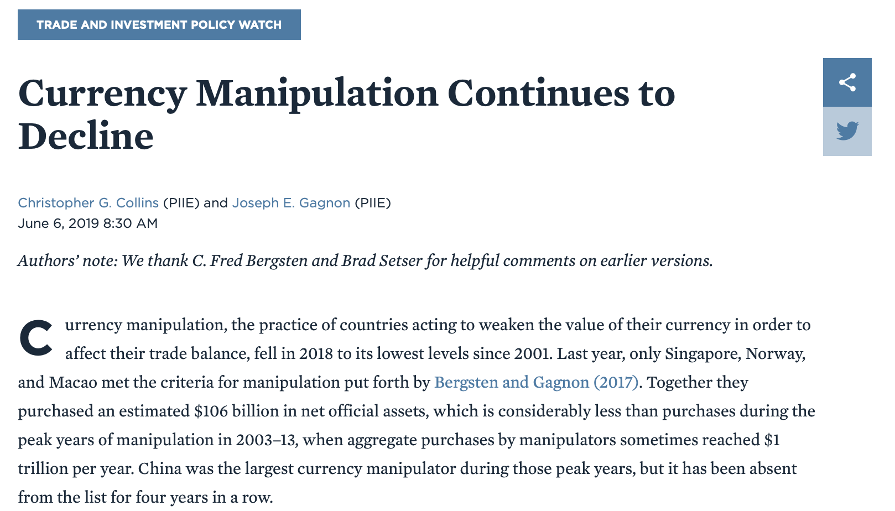
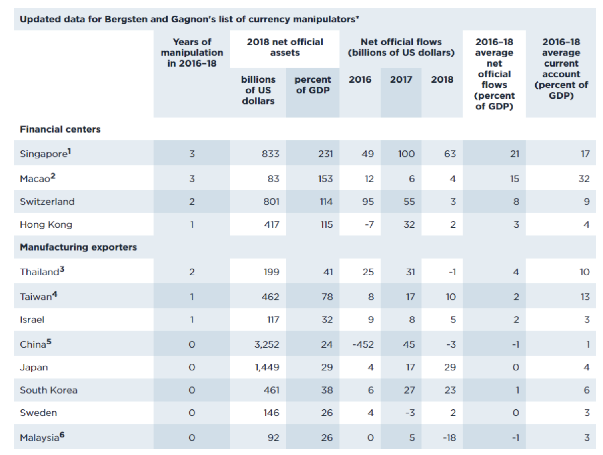
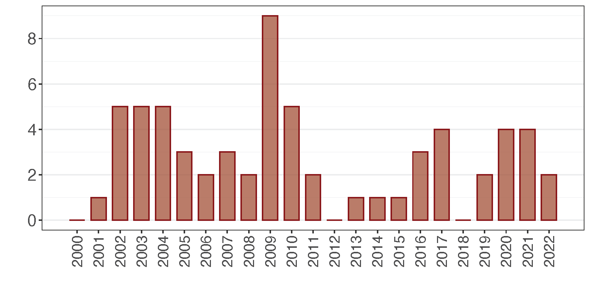
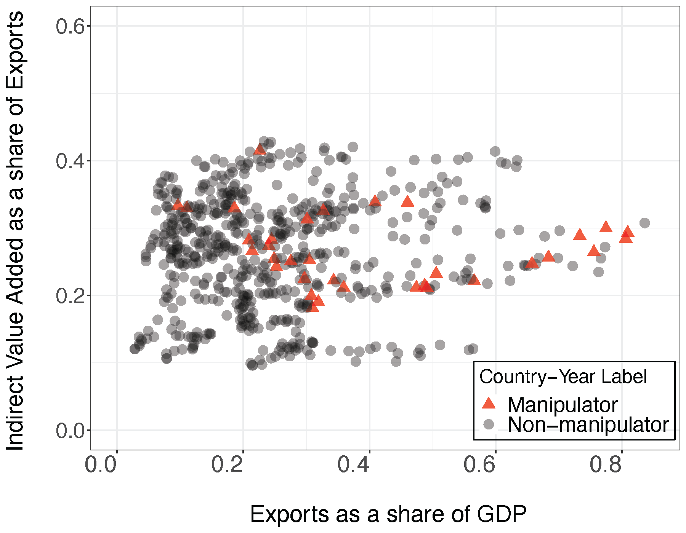
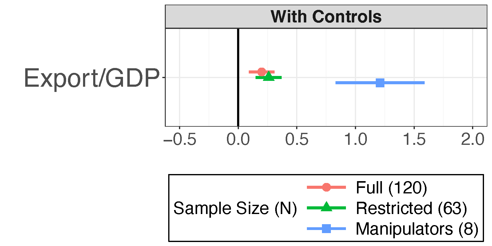
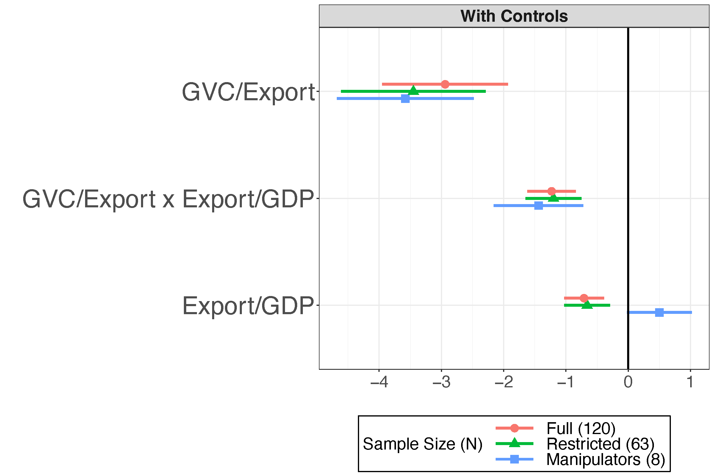
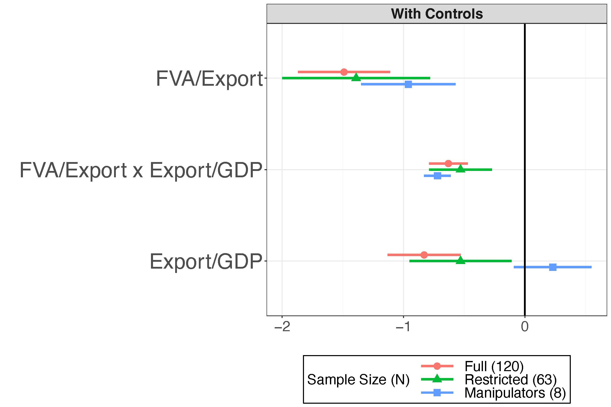
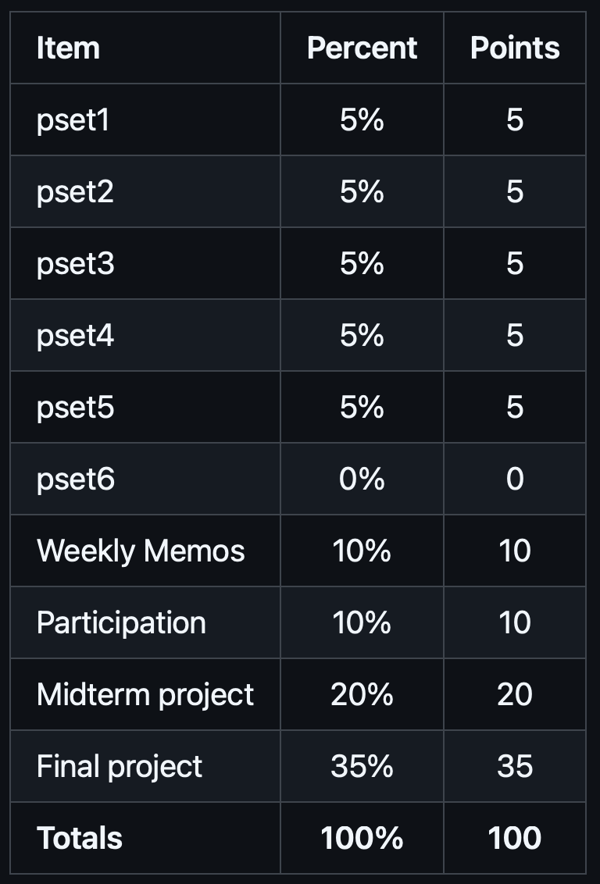

```{css,echo = F}
.small .remark-code { /*Change made here*/
  font-size: 85% !important;
}
.tiny .remark-code { /*Change made here*/
  font-size: 50% !important;
}
```

```{r,include=F}
set.seed(123)
options(width=60)
knitr::opts_chunk$set(fig.align='center',fig.width=9,fig.height=5,message=F,warning=F)
def.chunk.hook  <- knitr::knit_hooks$get("chunk")
knitr::knit_hooks$set(chunk = function(x, options) {
  x <- def.chunk.hook(x, options)
  ifelse(options$size != "normalsize", paste0("\n \\", options$size,"\n\n", x, "\n\n \\normalsize"), x)
})
```

# Agenda

1. Meet the instructor

2. Course Motivation

  - What is data science (DS) & why should we care?

3. Course Objectives

  - **Content:** Critical thinking, analysis, presentation

  - **Skills:** Computing and analysis in R

4. ChatGPT and data science
  
5. Course Expectations & Syllabus review

---

# Meet the instructor

- Education

--

  - PhD from UCLA Political Science in 2018

  - Postdocs at WashU and Princeton Niehaus
  
--

- Published some things

--

  - Substantive: [global value chains & currency manipulation](https://onlinelibrary.wiley.com/doi/abs/10.1111/ecpo.12184); [European politics](https://link.springer.com/article/10.1007/s11558-020-09410-0); [economics of land use](https://onlinelibrary.wiley.com/doi/abs/10.1093/aepp/ppy007); [book review on currency statecraft](https://www.cambridge.org/core/journals/perspectives-on-politics/article/abs/currency-statecraft-monetary-rivalry-and-geopolitical-ambition-by-benjamin-j-cohen-chicago-university-of-chicago-press-2019-208p-7500-cloth-2500-paper/6CC4A103F963E26FE3ED08A85B95D265) 

  - Policy: [2014 World Trade Report](https://www.wto.org/english/res_e/booksp_e/world_trade_report14_e.pdf); [polarization & lobbying](https://niehaus.princeton.edu/backlash-against-globalization-what’s-next)
  
--

- Work

--

  - World Trade Organization
  
  - Commercial Real Estate (2007/8 global financial crisis)

---

# Meet the instructor

- Current research

--

  - .red[Global value chains] + .blue[currency manipulation]

--

  - .red[Financial crises] + .blue[polarization]
  
--

  - .red[Trade agreements] + .blue[monopolies]
  
--

  - .red[Inequality] + .blue[economic growth]

---

# Why are you here?

--

background-image: url(./figs/fight_ds_econ.PNG)
background-size: contain

--

background-image: url(./figs/fight_ds_ps.PNG)
background-size: contain

--

background-image: url(./figs/fight_ds_cs.PNG)
background-size: contain

--

background-image: url(./figs/fight_ds_stats.PNG)
background-size: contain

--

background-image: url(./figs/fight_ds_stem.PNG)
background-size: contain

---

# Is this all just a fad?

--

- No


<center></center>


---

# Is this all just a fad?

- But there are faddish qualities

<center></center>


---

# So what IS data science?

- Split into two camps

--

1. .blue[Research] camp

--

  - Focused on **answering a research question**
  
  - Follows the "scientific method"
  
  - Goal: contribute to knowledge
  
  - Domain: academia
  
--
  
2. .red[Prediction] camp

--

  - Focused on **making a prediction**
  
  - Typically unconcerned with theory or *why* a model works
  
  - Goal: inform a decision / policy
  
  - Domain: private sector

--
  
(3. .red[Learning] camp)

--

  - Let the data "speak"
  
  - (More of a subset of camps 1 and 2)
  
---

# The Two Camps

<center></center>

---

# The Two Camps

<center></center>

---


# .blue[Research] Camp

- The scientific method

  1. .red[Observation] &rarr; .blue[Question]

--

  2. .blue[Theory] &rarr; .blue[Hypothesis]

--

  3. .red[Data Collection / Wrangling] &rarr; .red[Analysis]

--

  4. .red[Results] &rarr; .blue[Conclusion]
  
--

```{r,echo=F,fig.height=3,fig.align='center',warning=F,message=F}
require(tidyverse)
data.frame(step = c('Observation','Question','Theory','Hypothesis','Data Collection',
                    'Analysis','Results','Conclusion'),
           Framework = c('Data','Science','Science','Science','Data','Data','Data','Science'),
           x = c(.5,1.5,2.5,3.5,4.5,5.5,6.5,7.5),
           xend = c(1.5,2.5,3.5,4.5,5.5,6.5,7.5,8.5),
           y = c(-.5,-1,-2,-.75,-2,-1,-.75,-.5),
           yend = c(.5,1,2,.75,2,1,.75,.5)) %>%
  ggplot(aes(x = x,y = y,fill = Framework)) + 
  geom_rect(aes(xmin = x,ymin = y,xmax = xend,ymax = yend)) + 
  # geom_rect(xmin = c(2.5),ymin = c(-2),xmax = c(3.5),ymax = c(2),fill = NA,color = 'black',lwd = 2,
  #           inherit.aes = F) + 
  # geom_rect(xmin = c(4.5),ymin = c(-2),xmax = c(5.5),ymax = c(2),fill = NA,color = 'black',lwd = 2,
  #           inherit.aes = F) + 
  scale_fill_manual(values = c('red','blue')) +
  theme(axis.text.y = element_blank(),
        panel.background = element_rect(fill = 'grey90'),
        panel.grid.major = element_blank(), panel.grid.minor = element_blank(),
        axis.ticks = element_blank(),
        plot.background = element_rect(
          fill = "grey90" #,
          # colour = "black",
          # size = 1
        ),
        axis.text.x = element_text(angle = 45,hjust = 1,size = 14)) + 
  scale_x_continuous(breaks = seq(1,8,by = 1),labels = c('Observation','Question','Theory','Hypothesis','Data Prep',
                                                         'Analysis','Results','Conclusion')) + 
  xlab(NULL) + ylab(NULL)
```


---

# .blue[Research] Camp

- The scientific method

  1. .red[Observation] &rarr; .blue[Question]

  2. .blue[Theory] &rarr; .blue[Hypothesis]

  3. .red[Data Collection / Wrangling] &rarr; .red[Analysis]

  4. .red[Results] &rarr; .blue[Conclusion]

```{r,echo=F,fig.height=3,fig.align='center',warning=F,message=F}
require(tidyverse)
data.frame(step = c('Observation','Question','Theory','Hypothesis','Data Collection',
                    'Analysis','Results','Conclusion'),
           Framework = c('Data','Science','Science','Science','Data','Data','Data','Science'),
           x = c(.5,1.5,2.5,3.5,4.5,5.5,6.5,7.5),
           xend = c(1.5,2.5,3.5,4.5,5.5,6.5,7.5,8.5),
           y = c(-.5,-1,-2,-.75,-2,-1,-.75,-.5),
           yend = c(.5,1,2,.75,2,1,.75,.5)) %>%
  ggplot(aes(x = x,y = y,fill = Framework)) + 
  geom_rect(aes(xmin = x,ymin = y,xmax = xend,ymax = yend)) + 
  geom_rect(xmin = c(2.5),ymin = c(-2),xmax = c(3.5),ymax = c(2),fill = NA,color = 'black',lwd = 2,
            inherit.aes = F) + 
  geom_rect(xmin = c(4.5),ymin = c(-2),xmax = c(5.5),ymax = c(2),fill = NA,color = 'black',lwd = 2,
            inherit.aes = F) + 
  scale_fill_manual(values = c('red','blue')) +
  theme(axis.text.y = element_blank(),
        panel.background = element_rect(fill = 'grey90'),
        panel.grid.major = element_blank(), panel.grid.minor = element_blank(),
        axis.ticks = element_blank(),
        plot.background = element_rect(
          fill = "grey90" #,
          # colour = "black",
          # size = 1
        ),
        axis.text.x = element_text(angle = 45,hjust = 1,size = 14)) + 
  scale_x_continuous(breaks = seq(1,8,by = 1),labels = c('Observation','Question','Theory','Hypothesis','Data Prep',
                                                         'Analysis','Results','Conclusion')) + 
  xlab(NULL) + ylab(NULL)
```


---

# .blue[Research] Camp

--

<center></center>

---

# .blue[Research] Camp

1. **.red[Observation]** &rarr; **.blue[Question]**
  
--

  - Observation is facilitated by .red[data] (Descriptive analysis)

--



---

# .blue[Research] Camp

1. **.red[Observation]** &rarr; **.blue[Question]**

  - Observation is facilitated by .red[data] (Descriptive analysis)




---

# .blue[Research] Camp

1. **.red[Observation]** &rarr; **.blue[Question]**

  - Observation is facilitated by .red[data] (Descriptive analysis)
  
  - Number of currency manipulators per year according to Bergsten-Gagnon criteria




---

# .blue[Research] Camp

1. **.red[Observation]** &rarr; **.blue[Question]**

  - The question pertains to .blue[science]
  
--

  - I.e., why have countries stopped (or attenuated) currency manipulation?

<center></center>

---

# .blue[Research] Camp

2. **.blue[Theory]** &rarr; **.blue[Hypothesis]**
  
--

  - Theorizing requires abstraction & simplification
  
--

  - I.e., trade has changed and therefore exchange rate preferences have changed
  
--

  - Global value chains now account for 70% of global trade (~50% in 1990s)
  
--
  
  - Hypotheses fall out naturally from well-done theory
  
--
  
  - **H1**: *global value chain trade should moderate the relationship between export dependence and currency manipulation*

---

# .blue[Research] Camp

<ol start = 3>

<li> **.red[Data Collection / Wrangling]** &rarr; **.red[Analysis]**

  - Data collection separates "Data Science"...
  
  - ...from "Science, with data"

--
  
  - collect national input-output tables (matrices) & estimate global value chain linkages


---

background-image: url(./figs/plot11_empty1.png)
background-size: contain

--

background-image: url(./figs/plot11_empty2.png)
background-size: contain

--

background-image: url(./figs/plot11_empty3.png)
background-size: contain

--

background-image: url(./figs/plot11_1995.png)
background-size: contain

--

background-image: url(./figs/plot11_1996.png)
background-size: contain

--

background-image: url(./figs/plot11_1997.png)
background-size: contain

--

background-image: url(./figs/plot11_1998.png)
background-size: contain

--

background-image: url(./figs/plot11_1999.png)
background-size: contain

--

background-image: url(./figs/plot11_2000.png)
background-size: contain

--

background-image: url(./figs/plot11_2001.png)
background-size: contain

--

background-image: url(./figs/plot11_2002.png)
background-size: contain

--

background-image: url(./figs/plot11_2003.png)
background-size: contain

--

background-image: url(./figs/plot11_2004.png)
background-size: contain

--

background-image: url(./figs/plot11_2005.png)
background-size: contain

--

background-image: url(./figs/plot11_2006.png)
background-size: contain

--

background-image: url(./figs/plot11_2007.png)
background-size: contain

--

background-image: url(./figs/plot11_2008.png)
background-size: contain

--

background-image: url(./figs/plot11_2009.png)
background-size: contain

--

background-image: url(./figs/plot11_2010.png)
background-size: contain

--

background-image: url(./figs/plot11_2011.png)
background-size: contain

--

background-image: url(./figs/plot11_2012.png)
background-size: contain

--

background-image: url(./figs/plot11_2013.png)
background-size: contain

--

background-image: url(./figs/plot11_2014.png)
background-size: contain

--

background-image: url(./figs/plot11_2015.png)
background-size: contain

--

background-image: url(./figs/plot11_2016.png)
background-size: contain

--

background-image: url(./figs/plot11_2017.png)
background-size: contain

--

background-image: url(./figs/plot11_2018.png)
background-size: contain

--

background-image: url(./figs/plot11_2019.png)
background-size: contain

--

background-image: url(./figs/plot11_2020.png)
background-size: contain

---

# .blue[Research] Camp

<ol start = 3>

<li> **.red[Data Collection / Wrangling]** &rarr; **.red[Analysis]**

- Analysis is informed by the .red[data] you have collected...

- ...and the .blue[hypotheses] you have generated

<center></center>

---

# .blue[Research] Camp

<ol start = 3>

<li> **.red[Data Collection / Wrangling]** &rarr; **.red[Analysis]**

- Analysis is informed by the .red[data] you have collected...

- ...and the .blue[hypotheses] you have generated

<center></center>

---

# .blue[Research] Camp

<ol start = 4>

<li> **.red[Results]** &rarr; **.blue[Conclusion]**

  - Results fall out naturally from the analysis...
  
  - ...and must be interpreted in terms of the theory and hypotheses...
  
  - ...to draw conclusions

<center></center>

---

# .blue[Research] Camp

<ol start = 4>

<li> **.red[Results]** &rarr; **.blue[Conclusion]**

  - Results fall out naturally from the analysis...
  
  - ...and must be interpreted in terms of the theory and hypotheses...
  
  - ...to draw conclusions

<center></center>

---

# .blue[Research] Camp

<ol start = 4>

<li> **.red[Results]** &rarr; **.blue[Conclusion]**

  - Results fall out naturally from the analysis...
  
  - ...and must be interpreted in terms of the theory and hypotheses...
  
  - ...to draw conclusions

<center></center>

---

# The Two Camps

<center></center>


---

# Course Objectives

- This course is the menu, not the food

--

  - Look over many different fields, methods, and tools

--

  - You pick those you like, and take more advanced classes to dig into them

--

- But we are very **hands on**

--

  - You must download `R` and `RStudio` prior to next class (Problem Set 0)
  
--

  - You must work through first HW using an `.Rmd` file
  
---

# Learning goals

1. Generate a sophisticated research question based on clearly described assumptions and a narrowly defined hypothesis.

--

2. Describe the data used to investigate this research question, including univariate and multivariate visualizations and summary statistics.

--

3. Apply the appropriate methods to answer the research question and evaluate the hypothesis.

--

4. Acknowledge limitations of method and results, and describe a superior empirical setting that would overcome these limitations.


---

# ChatGPT in the classroom

- Are we at the precipice of a new era in human-computer relations?

--

  - ChatGPT can achieve these learning goals!
  
--

  - But it needs to be used wisely...it is still a tool
  
--

- It can make coding (the hardest part of this class) easier

--

- But it can also prevent you from learning

---

# AI in the labor market

- McKinsey told AT&T in 1980 that, by 2000, cell phones would be a niche market of 900,000 subscribers

--

- Is AI-assisted work is the future?

--

  - Profound gains in productivity already

--

- Will this be like automation and globalization for US manufacturing?
  
--

  - What skills will be valuable in 5 years? 10 years?
  
---

# AI in the labor market

--

- My answer: prepare you for both possibilities

--

  - If AI is a "fad", make sure you can do this work unassisted
  
  - If AI is the new normal, make sure you can work with it productively
  
--

- The one thing you **shouldn't** do

--

  - Take shortcuts / cheat
  
--

- You will still have an interview in which you are asked something like the following: "How is overfitting different from underfitting, and why should we care?"

--

  - **You** need to know this answer


---

# Grades

<center></center>

---

# Grades: PSets

- 9 in total, only 8 are graded (one freebie)

--

  - Pset 0 doesn't count
  
--

  - 5 points each + 1 EC
  
--

- Posted to **GitHub** on Mondays at noon

--

- Due **Friday by midnight**

  - Submit/Upload to **Blackboard**

  - Each day late is -1 point

  - After 3 days, scored zero
  
--

- Restrictions:

  - Open book / open note / open Campuswire

  - Can collaborate but submissions must be your own
  
--

- **Must submit a record of ChatGPT work with the problem set**
  
---

# Grades: Final Project

- Final project is 10 points 
  
  - 8 points for final submission
  - 2 points for presentation in final week (5-8 minutes) 
  - 2 EC points: 1 point for each classmate you give feedback to after the presentations, max. 2 points (submit via Campuswire)

- Task: create a report that takes a dataset of your choice and uses
the skills you learn in this class to tell us something about it. Use at least two skills from first half, two skills from second half. Minimum 8 pages, double-spaced, 12pt font.


---

# Grades: Exams

- 1 in total: midterm on October 9th

--

- Midterm is 20 points + 2 EC

--

- Final is 20 points + 2 EC (may opt out of exam!)


---

# Grades: Quizzes

- Taken at beginning of each lecture

- Each quiz is worth one point

- 19 total quizzes, only 15 count toward final grade (four freebies)

--

- Password protected

  - Only students in class can take them
  
  - 50% of quiz grade is just taking it (effectively a way to track attendance)
  
  - 50% of quiz grade are questions related to **homework**


---

# Not Graded: HW

- You should work through the homeworks prior to each lecture

--

- Open the `.Rmd` file and Knit it

--

- Read the output and try and answer the prompts

--

- **Not graded**, but enormously helpful in preparing you to keep up with lectures


---

# The Syllabus

- (Go to Github)

---

# Honor Code

--

- Students are assumed to have read and agreed with the [Villanova University Academic Integrity policy](https://www.vanderbilt.edu/student_handbook/the-honor-system/)

--

- Violations of this policy may result in:

--

  - An F for the semester (at minimum)
  
  - Suspension for a semester
  
  - Expulsion
  
--

- However, except where **explicitly noted**, this course is collaborative

--

  - Open book, open note, open internet
  
  - Can rely on Campuswire for help
  
  - Can work together on problem sets (but must submit own work)
  
--

- **Can't collaborate on exams**

---

# Resources

- Campuswire (place for **questions**)

  - Post questions on the class feed
  
--

- Blackboard (place for **submissions**)

  - Submit problem sets, quizzes, and exams
  
--

- GitHub (place for **materials**)

  - Find all in-class materials
  
--

- Office hours (place for **hands-on help**)
  
---

# Teaching Philosophy

<center></center>

---

# Teaching Philosophy

- This course is **inherently** hard

--

  - Learning `R` is challenging
  
--

- But the goal is to **encourage** you to pursue data science

--

- As such, the **nature** of the material is at odds with the **goal** of the class

--

- My solution: grade leniently

--

  - I.e., lots of extra credit

---

# Conclusion

- Let's have a great semester!

--

- Homework:

--

  1. Work through psc4175_hw_1.Rmd
  
  2. Complete Problem Set 0 (on GitHub)
  
  3. Create a Copilot account (https://copilot.microsoft.com/)
