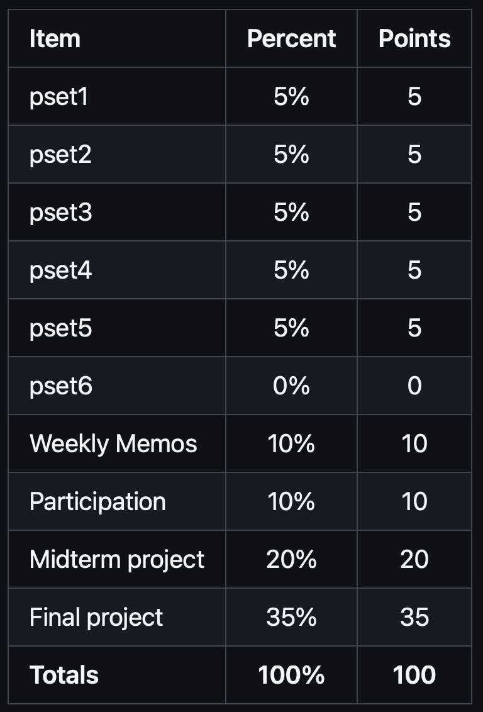

```{css,echo = F}
.small .remark-code { /*Change made here*/
  font-size: 85% !important;
}
.tiny .remark-code { /*Change made here*/
  font-size: 50% !important;
}
```

```{r,include=F}
set.seed(123)
options(width=60)
knitr::opts_chunk$set(fig.align='center',fig.width=9,fig.height=5,message=F,warning=F)
def.chunk.hook  <- knitr::knit_hooks$get("chunk")
knitr::knit_hooks$set(chunk = function(x, options) {
  x <- def.chunk.hook(x, options)
  ifelse(options$size != "normalsize", paste0("\n \\", options$size,"\n\n", x, "\n\n \\normalsize"), x)
})
```

# Agenda

1. Motivation & Expectations

2. Requiring packages

  - `install.packages("tidyverse")` 

  - `require(tidyverse)`

3. Loading and manipulating data

  - `readRDS()`

  - `%>%`

4. `tidyverse` functions

  - `filter`, `select`, `summarize`, `mutate`, `group_by`
  
5. Plotting in `R`

  - `ggplot` (`+` instead of `%>%`)  

---

# What IS data science?

- Split into two camps

--

1. .blue[Research] camp

--

  - Focused on **answering a research question**
  
  - Follows the "scientific method"
  
  - Goal: contribute to knowledge
  
  - Domain: academia
  
--
  
2. .red[Prediction] camp

--

  - Focused on **making a prediction**
  
  - Typically unconcerned with theory or *why* a model works
  
  - Goal: inform a decision / policy
  
  - Domain: public & private sectors
  
---

# The Two Camps

<center></center>

---

# The Two Camps

<center></center>

---


# .blue[Research] Camp

- The scientific method

  1. .red[Observation] &rarr; .blue[Question]

--

  2. .blue[Theory] &rarr; .blue[Hypothesis]

--

  3. .red[Data Collection / Wrangling] &rarr; .red[Analysis]

--

  4. .red[Results] &rarr; .blue[Conclusion]
  
--

```{r,echo=F,fig.height=3,fig.align='center',warning=F,message=F}
require(tidyverse)
data.frame(step = c('Observation','Question','Theory','Hypothesis','Data Collection',
                    'Analysis','Results','Conclusion'),
           Framework = c('Data','Science','Science','Science','Data','Data','Data','Science'),
           x = c(.5,1.5,2.5,3.5,4.5,5.5,6.5,7.5),
           xend = c(1.5,2.5,3.5,4.5,5.5,6.5,7.5,8.5),
           y = c(-.5,-1,-2,-.75,-2,-1,-.75,-.5),
           yend = c(.5,1,2,.75,2,1,.75,.5)) %>%
  ggplot(aes(x = x,y = y,fill = Framework)) + 
  geom_rect(aes(xmin = x,ymin = y,xmax = xend,ymax = yend)) + 
  # geom_rect(xmin = c(2.5),ymin = c(-2),xmax = c(3.5),ymax = c(2),fill = NA,color = 'black',lwd = 2,
  #           inherit.aes = F) + 
  # geom_rect(xmin = c(4.5),ymin = c(-2),xmax = c(5.5),ymax = c(2),fill = NA,color = 'black',lwd = 2,
  #           inherit.aes = F) + 
  scale_fill_manual(values = c('red','blue')) +
  theme(axis.text.y = element_blank(),
        panel.background = element_rect(fill = 'grey90'),
        panel.grid.major = element_blank(), panel.grid.minor = element_blank(),
        axis.ticks = element_blank(),
        plot.background = element_rect(
          fill = "grey90" #,
          # colour = "black",
          # size = 1
        ),
        axis.text.x = element_text(angle = 45,hjust = 1,size = 14)) + 
  scale_x_continuous(breaks = seq(1,8,by = 1),labels = c('Observation','Question','Theory','Hypothesis','Data Prep',
                                                         'Analysis','Results','Conclusion')) + 
  xlab(NULL) + ylab(NULL)
```


---

# .blue[Research] Camp

- The scientific method

  1. .red[Observation] &rarr; .blue[Question]

  2. .blue[Theory] &rarr; .blue[Hypothesis]

  3. .red[Data Collection / Wrangling] &rarr; .red[Analysis]

  4. .red[Results] &rarr; .blue[Conclusion]

```{r,echo=F,fig.height=3,fig.align='center',warning=F,message=F}
require(tidyverse)
data.frame(step = c('Observation','Question','Theory','Hypothesis','Data Collection',
                    'Analysis','Results','Conclusion'),
           Framework = c('Data','Science','Science','Science','Data','Data','Data','Science'),
           x = c(.5,1.5,2.5,3.5,4.5,5.5,6.5,7.5),
           xend = c(1.5,2.5,3.5,4.5,5.5,6.5,7.5,8.5),
           y = c(-.5,-1,-2,-.75,-2,-1,-.75,-.5),
           yend = c(.5,1,2,.75,2,1,.75,.5)) %>%
  ggplot(aes(x = x,y = y,fill = Framework)) + 
  geom_rect(aes(xmin = x,ymin = y,xmax = xend,ymax = yend)) + 
  geom_rect(xmin = c(2.5),ymin = c(-2),xmax = c(3.5),ymax = c(2),fill = NA,color = 'black',lwd = 2,
            inherit.aes = F) + 
  geom_rect(xmin = c(4.5),ymin = c(-2),xmax = c(5.5),ymax = c(2),fill = NA,color = 'black',lwd = 2,
            inherit.aes = F) + 
  scale_fill_manual(values = c('red','blue')) +
  theme(axis.text.y = element_blank(),
        panel.background = element_rect(fill = 'grey90'),
        panel.grid.major = element_blank(), panel.grid.minor = element_blank(),
        axis.ticks = element_blank(),
        plot.background = element_rect(
          fill = "grey90" #,
          # colour = "black",
          # size = 1
        ),
        axis.text.x = element_text(angle = 45,hjust = 1,size = 14)) + 
  scale_x_continuous(breaks = seq(1,8,by = 1),labels = c('Observation','Question','Theory','Hypothesis','Data Prep',
                                                         'Analysis','Results','Conclusion')) + 
  xlab(NULL) + ylab(NULL)
```


---

# Course Objectives

- The second half of the course is just the menu, not the food

  - Look over many different fields, methods, and tools

  - You pick those you like, and take more advanced classes to dig into them (e.g., in the spring!)

--

- But we are very **hands on**

  - Everything will be done in `RStudio`
  
---

# Learning goals

1. Generate a sophisticated research question based on clearly described assumptions and a narrowly defined hypothesis.

--

2. Describe the data used to investigate this research question, including univariate and multivariate visualizations and summary statistics.

--

3. Apply the appropriate methods to answer the research question and evaluate the hypothesis.

--

4. Acknowledge limitations of method and results, and describe a superior empirical setting that would overcome these limitations.


---

# ChatGPT in the classroom

- Are we at the precipice of a new era in human-computer relations?

  - ChatGPT can help us achieve our learning goals

  - But it needs to be used wisely...it is still a tool
  
--

- It can make coding (the hardest part of this class) easier

--

- But it can also prevent you from learning

--
  - ...and it also uses a lot of energy (use sparingly)

---

# AI in the labor market

- Is AI-assisted work the future?

--

  - Profound gains in productivity already

--

- Will this be like automation and globalization for US manufacturing?
  
--

  - What skills will be valuable in 5 years? 10 years?
  
---

# AI in the labor market

--

- My answer: prepare you for both possibilities

--

  - If AI is a "fad", make sure you can do this work unassisted
  
  - If AI is the new normal, make sure you can work with it productively
  
--

- The one thing you **shouldn't** do

--

  - Take shortcuts / cheat
  
--

- You will still have an interview in which you are asked something like the following: "How is overfitting different from underfitting, and why should we care?"

--

  - **You** need to know this answer


---

# Grades

<center></center>

---

# Grades: PSets

- 6 in total, only 5 are graded (one freebie)

  - Pset 0 doesn't count

  - 5 points each

- Posted to **GitHub** on Mondays at noon

- Due **Friday by midnight**

  - Submit/Upload to **Blackboard**

  - Each day late is -1 point; after 3 days, scored zero

- Restrictions:

  - Open book / open note / open Campuswire

  - Can collaborate but submissions must be your own

- **Must submit a record of ChatGPT work with the problem set**
  
---

# Grades: Final Project

- Final project is 35 points 
  
  - 25 points for final submission
  - 10 points for presentation in final weeks (max. 10 minutes)
  - 3 EC points: 1 point for each classmate you give feedback to after the presentations, max. 3 points (submit via Campuswire)

---

# Not Graded: HW

- You should work through the homeworks prior to each lecture

- Open the `.Rmd` file and Knit it

- Read the output and try and answer the prompts

- **Not graded**, but enormously helpful in preparing you to keep up with lectures

---

# Resources

- Campuswire (place for **questions**)

  - Post questions on the class feed


- Blackboard (place for **submissions**)

  - Submit problem sets

- GitHub (place for **materials**)

  - Find all in-class materials

- Office hours (place for **hands-on help**)
  
---

# Teaching Philosophy

<center></center>

---

# Teaching Philosophy

- This part of the course is **inherently** hard

  - Learning `R` is challenging

- But the goal is to **encourage** you to pursue more knowledge in quantitative methods

- As such, the **nature** of the material is at odds with the **goal** of the class

- My solution: grade leniently

---

# Let's get started! 

--

- Folder structure + `setwd()`

--

  - Concept: keep everything together...
  
--

  - ...and **related**

--

.center[]


---

# Let's get started! 

- Folder structure + `setwd()`

  - Concept: keep everything together...

  - ...and **related**

.center[]


---

# Installing software

--

- [`R: https://cran.r-project.org/`](https://cran.r-project.org/)

  - Accept all defaults
  
--

- [`RStudio: https://rstudio.com/products/rstudio/download/`](https://rstudio.com/products/rstudio/download/)

  - Download the version for your OS
  
--

- Open `RStudio` and create a new rmarkdown (`.Rmd`) file

--

  - Accept defaults, give it a sensible name, delete the default text, then save it to your folder (again with a sensible name)
  
--

  - You should follow along with the lecture in this file! Take notes here! Try code here!

---

# How to type in `.Rmd`
````{verbatim, lang = "markdown"}
# This is a header

## This is a subheader

### This is a subsubheader

This is plain text.
````
--

# This is a header

## This is a subheader

### This is a subsubheader

This is plain text.


---

# How to type in `.Rmd`
````{verbatim, lang = "markdown"}
- This is

- a bulleted

  - List

1. This is

2. a numbered list
````

--

- This is

- a bulleted

  - List

1. This is

2. a numbered list

---

# How to type in `.Rmd`

```{verbatim, lang = "markdown"}
 **Bold font**, *italic font*, `code font`
```
--

**Bold font**, *italic font*, `code font`

--

- Most Importantly! `R` code!

````{verbatim,lang = "markdown"}
```{r}
2+2
```
````

--

```{r}
2+2
```

---

# How `R` Works

--

- **O**bject **O**riented **L**anguage (**OOL**)

--

  - Objects are created with the `<-` command
  
--

  - You *can* run code directly...
  

```{r}
2+2
```

---

# How `R` Works


- **O**bject **O**riented **L**anguage (**OOL**)

  - Objects are created with the `<-` command

  - ...but most of what we'll do involves objects
  

```{r}
object1 <- 2+2
```

--

- Object assignment operator **saves** the output

- It **does not print** the output

--

- To see, just call the object

```{r}
object1
```

---

# How `R` Works


- **O**bject **O**riented **L**anguage (**OOL**)

  - Objects are created with the `<-` command

  - They can be named anything (so be intuitive!)
  

```{r}
two_plus_two <- 2+2
two_plus_two
```

---

# How `R` Works

- **O**bject **O**riented **L**anguage (**OOL**)

  - Objects are created with the `<-` command

  - Objects can store many different things
  
```{r}
an_element <- 2+2
a_vector <- c(1,2,3)
a_list <- list('element1' = 2+2,
               'element2' = "hello world!",
               'element3' = runif(n = 10,min = 0,max = 10))
a_function <- function(x) {
  avg_of_x <- sum(x) / length(x)
  return(avg_of_x)
}
```

---

# How `R` Works

- Objects **persist!**
```{r}
an_element # This object stores 2+2
a_vector   # This object stores the integers 1, 2, and 3

an_element*a_vector
an_element-a_vector
```

---

# A comment on comments

- If you use a # sign inside a code chunk, you can write a comment

```{r}
# This is a comment. If I compile the code, nothing will happen.

# This is another comment. These are helpful for annotating my code.
```

---

# How `R` Works

- Objects **persist!**
```{r}
# This object stores:
  # 1) 2+2 (named "element1")
  # 2) the text "hello world!" (named "element2")
  # 3) 10 numbers randomly drawn between 0 and 10
a_list
```

---

# How `R` Works

- Objects **persist!**
```{r}
# Let's apply our function ("a_function") to "element3" in "a_list"
a_function(x = a_list[['element3']])
```

--

- We could also call `element3` from `a_list` with a dollar sign

```{r}
# This does the same thing as the previous slide...it just accesses element3 differently.
a_function(x = a_list$element3)
```

---

# How `RStudio` Works

--

- `RStudio` is a powerful way to interact with `R`

--

- In base `R`, you interact with the program via the "command line"

--

  - For example...
  
--

- But to save your work, you can write "scripts"

--

  - For example...
  
--

- *This is all cumbersome!*

--

- Enter, `RStudio`

---

# How `RStudio` Works

--

- `RStudio` allows us to:

--

  1. Write scripts
  2. Run scripts
  3. See results

--

- It is **deeply interactive**

--

  - We can highlight a line and press `ctrl+enter` / `cmd+enter` and see the result
  
--

  - **We can even do this with single objects!**
  
---

# Give it a try

- Comment **everything**

--

- Create two objects

  - `a` contains the product of 3 and 5 (`3*5`)
  
  - `b` contains five numbers `c(10,21,43,87,175)`
  
--

- Now create object `c` which is `a - b`

```{r}
# INSERT CODE HERE
```

---

# Functions & Packages

--

- What are `packages`?

--

  - Basically, **functions** that someone else wrote
  
--

- `R` has many functions already installed

--

  - These are known as "base `R`" and contain many useful functions

--

  - For example, `sum()` will add up a vector of numbers

--

```{r,echo=TRUE,eval=FALSE}
sum(object1)
```
  
--

  - Quiz: What does the `mean()` function do? The `median()`? The `range()`?
  
--

- Other base `R` functions interact with other files

--

  - For example, `read.csv()` will load a `.csv` file
  
--

- And there are MANY **MANY** more

---

# Installing Packages

--

- In addition to the functions included in base `R`, we want more

--

- For this class, we want one called `tidyverse`

--

  - `tidyverse` contains many (hundreds?) of functions that make `R` easier
  
--

  - But it is NOT included in the base `R` set of functions
  
--

  - Therefore, we need to add it
  
--

- Use the base `R` function `install.packages("[PACKAGE NAME]")`

--

  - Specifically, `install.packages("tidyverse")`
  
---

# Requiring Packages

--

- Once installed, a package will live somewhere on your computer

--

- However, any new *instance* of `R` will not automatically load the packages

--

- We need to `require()` them to tell `R` to load them

--

  - Alternatively, we can use `library()` (but it's the same result)
  
--

- So load the `tidyverse` package with `require(tidyverse)`

```{r,echo=FALSE,warning=FALSE,message=FALSE}
require(tidyverse)
```

--

  - NB: you need quotes for the `install.packages()` function...
  
--

    - i.e., `install.packages("tidyverse")`
    
--

  - but NOT for the `require()` function
  
--

    - i.e., `require(tidyverse)`
  
---

# Loading Data

--

- So you should be using `R` via `RStudio` with the `tidyverse` package loaded

--

- Now let's load some data

--

- You can save it locally from the course  [github page](https://github.com/rweldzius/PSC7000_F2024/raw/main/Data/sc_debt.Rds) and then load it from your computer
  
--

- Or you can load it directly from the internet with the `read_rds()` function from `tidyverse`

--

  - NB: `R` is an "object-oriented language" (OOL)

--

  - We **create** an "object" to store the data using a left-arrow: `<-`

--

```{r}
df<-read_rds("https://github.com/rweldzius/PSC7000_F2024/raw/main/Data/sc_debt.Rds")
```

--

  - url: https://github.com/rweldzius/PSC7000_F2024/raw/main/Data/sc_debt.Rds
---

# Loading Data

--

- We now have the contents of `sc_debt.Rds` stored in the object `df`

--

  - This is a "tabular data frame", aka a `tibble`
  
  - **Rows** are observations
  
  - **Columns** are values

--

- We can look at this object directly

```{r}
df
```

---

# Loading Data

--

- Or we can look at its columns

```{r}
names(df)
```

---

# Loading Data

--

```{r,echo=FALSE,message=FALSE}
defs <- data.frame(Name = names(df),
                   Definition = c('Unit ID','Institution Name','State Abbreviation','Median Debt of Graduates',
                            'Control Public or Private','Census Region','Predominant Degree Offered: Assocates or Bachelors',
                            'Open Admissions Policy: 1=Yes, 2=No, 3=No 1st time students',
                            'Admissions Rate: proportion of applications accepted','Type of institution*',
                            'Average SAT scores',
                            'Average Earnings of Recent Graduates',
                            'Number of undergraduates',
                            'Average cost of attendance (tuition-grants)',
                            'Institution admits fewer than 10% of applications, 1=Yes, 0=No',
                            'Institution is a research university, 1=Yes, 0=No'))
```

```{r,echo=FALSE,warning=FALSE,message=FALSE}
require(kableExtra)
defs %>%
  kbl() %>%
  kable_paper("hover", full_width = F,font_size = 12)
```
&ast;<font size="2">See [here](https://data.ed.gov/dataset/9dc70e6b-8426-4d71-b9d5-70ce6094a3f4/resource/658b5b83-ac9f-4e41-913e-9ba9411d7967/download/collegescorecarddatadictionary_01192021.xlsx)</font>

---

# Manipulating the Data

--

- These data are cool!

--

- But TMI at first

--

- I want to know...

--

  - Where is `Villanova University`?
  
--

  - Which school is the most selective?
  
--

  - Which schools produce the richest grads?
  
--

- There are `tidyverse` functions to answer all of these questions

---

# Manipulating with `tidyverse`

- The code process of `tidyverse` relies on a "pipe" symbol: `%>%`

--
  
  - Think of it as a "chain" that **links code together**
  
  - Or maybe a "do" symbol because it tells `R` what to do
  
--

- The basic grammar of `R` is: object, `%>%`, verb

```{r,eval=FALSE}
object %>%  # This is the object
   function() # This is the verb
```

---

# Manipulating with `tidyverse`

- `tidyverse` has many useful "verbs" (i.e., functions)

  - `filter()`: subsets **rows**
  
  - `select()`: subsets **columns**
  
  - `arrange()`: sorts **rows** based on **columns**
  
  - `summarise()`: collapses **rows**
  
  - `group_by()`: groups **rows** by **columns**
  
---

# Manipulating: `filter()`

- So let's look at Villanova

--

- `filter` will select **rows** of the data based on some criteria

--

```{r}
df %>%
  filter(instnm == "Villanova University") # Only select rows with Villanova
```

---

# Manipulating: `select()`

- Still TMI!

--

- I only care about the admissions rate (`adm_rate`), the SAT scores (`sat_avg`), and the future earnings (`md_earn_wne_p6`)

--

- `select` will select **columns**

```{r}
df %>%
  filter(instnm == "Villanova University") %>%
  select(instnm,adm_rate,sat_avg,md_earn_wne_p6) # Only select four columns
```

---

# Manipulating: `arrange()`

- How does Villanova compare...?

--

  - to other schools in terms of SAT scores?
  
  - to other schools in terms of future earnings?
  
  - to other schools in terms of admissions rates?

--

- `arrange` will sort the data based on a column (ascending!)

```{r}
df %>%
  arrange(sat_avg) %>% # Sort data by SAT scores
  select(instnm,sat_avg) # Only look at name and SAT scores
```

---

# Manipulating: `arrange()`

- Villanova is not in the bottom 10 schools

```{r}
df %>%
  arrange(sat_avg) %>% # Sort data by SAT scores
  select(instnm,sat_avg) # Only look at name and SAT scores
```

---

# Manipulating: `arrange()`

- Use `desc()` to order in descending Villanova not in top 10 either

```{r}
df %>%
  arrange(desc(sat_avg)) %>% # Sort data by SAT scores (descending)
  select(instnm,sat_avg) # Only look at name and SAT scores
```

---

# Manipulating: `arrange()`

- What if we look only at "selective" schools (i.e., those who accept less than 10% of applicants)?

--

```{r}
df %>%
  filter(adm_rate < .1) %>% # Only look at schools who accept less than 10%
  arrange(sat_avg,adm_rate) %>% # Sort data by SAT scores AND THEN admissions rates (breaks ties)
  select(instnm,adm_rate,sat_avg) # Only look at name, admissions rate, and SAT scores
```


---

# How does Villanova compare?

--

- `arrange` in descending order

```{r}
df %>%
  filter(adm_rate < .1) %>%
  arrange(desc(sat_avg),adm_rate) %>%
  select(instnm,adm_rate,sat_avg)
```


---

# More complicated? More `%>%`!

--

- Less selective schools by SAT with debt and state

```{r}
df %>%
  filter(adm_rate > .2 & adm_rate < .3) %>% # Less selective schools (accept between 20% and 30%)
  arrange(stabbr,desc(sat_avg)) %>% # Sort by state name, then by SAT scores
  select(instnm,sat_avg,grad_debt_mdn,stabbr) # Only look at some columns
```

---

# A quick aside on missingness

--

- Some rows have `NA` in some columns

--

  - `NA` is the standard code for **missing data** in `R`
  
  - Data can be missing for many different reasons (i.e., some schools don't require SAT scores or record them)
  
  - We can use a base `R` function called `is.na()` which will be `TRUE` if the value is `NA` or `FALSE` otherwise
  
--

  - And we can combine `is.na()` with the `filter()` function from `tidyverse`

--

- How many schools don't report SAT scores?

---

# A quick aside on missingness

```{r}
df %>%
  filter(is.na(sat_avg)) %>% # Only look at schools that DON'T report SATs
  select(instnm,stabbr) # Only look at the name and the state
```


---

# Stepping back

--

- Thus far, lots of .red[data]

--

- Not a lot of .blue[science]

--

- But remember the .blue[Research] camp!

--

  1. .red[Observation] &rarr; .blue[Question]

  2. .blue[Theory] &rarr; .blue[Hypothesis]

  3. .red[Data Collection / Wrangling] &rarr; .red[Analysis]

  4. .red[Results] &rarr; .blue[Conclusion]
  
--

- We have been doing lots of .red[Observation]!

--

- Do we have any good .blue[Research questions]?

---

# Stepping back

- .blue[RQ]: How might admissions and SAT scores be **related**?

--

  - .blue[Theory]: selective schools have stricter criteria
  
--

  - .blue[Hypothesis]: admissions and SAT scores should be **negatively** related
  
--

- How can we test this hypothesis?


---

# Summarizing Data: `summarise()` + `mean()`

--

- We can combine base `R` functions with `tidyverse` functions!

--

  - Base `R`: `mean()`
  
  - `tidyverse`: `summarise()` (aka `summarize()`)
  
- Overall average SAT scores

```{r}
df %>%
  summarise(mean_sat = mean(sat_avg,na.rm=T)) # Average SAT scores for entire data
```

---

# Summarizing Data

--

- Let's unpack this

```{r,eval=F}
df %>%
  summarise(mean_sat = mean(sat_avg,na.rm=T))
```

--

  - Create new variable `mean_sat` that contains the `mean()` of every school's average SAT score
  
--

  - `na.rm=T` means we want to ignore missing data. If not?
  
--
  
```{r,eval=T}
df %>%
  summarise(mean_sat = mean(sat_avg))
```

---

# Summarizing Data

--

- Recall we want see if more selective schools have higher SAT scores

--

```{r,eval=T}
df %>%
  filter(adm_rate < .1) %>% # Look at schools who accept < 10% of applicants
  summarise(mean_sat_LT10 = mean(sat_avg,na.rm=T)) # Calculate the average SAT score
```

--

```{r,eval=T}
df %>%
  filter(adm_rate > .1) %>% # Look at schools who accept > 10% of applicants
  summarise(mean_sat_GT10 = mean(sat_avg,na.rm=T)) # Calculate the average SAT score
```

---

# Summarizing Data: `group_by()`

--

- One final `tidyverse` function: `group_by()`

--

- There is a column called `selective` which is either 1 or 0

--

  - 1: the admissions rate is less than 10%
  
  - 0: otherwise
  
--

```{r}
df %>%
  select(instnm,selective,adm_rate)
```

---

# Summarizing Data: `group_by()`

- Instead of running two separate `filter()` commands, use `group_by()`

--

```{r,eval=T}
df %>%
  group_by(selective) %>% # Group the data by selective (either 1 or 0)
  summarise(mean_sat = mean(sat_avg,na.rm=T)) # Calculate average SAT for each group
```

---

# Results

- Do more selective schools have higher SAT scores?

--

  - Yes

--

- This .red[Result] **confirms** our .blue[Hypothesis] and **answers** our .blue[Research Question]

---

# Summary

--

- What we've done so far is a microcosm of data science

--

  1. Opened .red[data] (`readRDS`)
  
--
  
  2. Looked at .red[data] (`tidyverse` + `select()`, `filter()`, `arrange()`)
    
--

  3. Generated .blue[hypotheses] (Admissions versus SAT scores)
  
--

  4. .red[Tested] .blue[hypotheses] (`summarise()` + `mean()`)


---

# Now let's take a step back and understand *Tabular Data*

- Data comes in many different formats

--

- **Structured data**: standardized, well-defined structure, easily accessed

  - I.e., tables, databases
  
--
  
- **Unstructured data**: messy, organic, disorganized, hard to use

  - I.e., web pages, images, videos

  
--

- In this class, we will always be working with **structured** data...specifically "tabular data frames"

--

- This still requires work to prepare!

---

# Tabular Data Frame

- AKA a "tibble"

--

- These are "square" (although actually rectangular)

--

- Rows: **units of observation** (i.e., the entities we are studying)

--

  - People (each row is a survey respondent, athlete, etc.)
  
  - Places (each row is a state, county, country, etc.)
  
  - Things (each row is a tweet, firm, product, etc.)
  
--

- Columns: **variables of interest** (i.e., attributes we are studying)

--

  - Beliefs / behaviors / etc. (i.e., where rows are people)
  
  - Rainfall / crimes / etc. (i.e., where rows are places)
  
  - Likes / profits / etc. (i.e., where rows are things)
  
---

# Looking at Data

--

- We now have the contents of `sc_debt.Rds` stored in the object `df`

--

- We can look at this object directly

```{r}
df
```

---

# Looking at Data

- What is our **unit of observation**?

--

  - Academic institutions: each row is a single school

--

- What are our **variables of interest**?

--

  - Let's look!
  
```{r}
colnames(df) # Prints the variable names
```

---

# Good Data has Codebooks!

```{r,echo=FALSE,message=FALSE}
defs <- data.frame(Name = names(df),
                   Definition = c('Unit ID','Institution Name','State Abbreviation','Median Debt of Graduates',
                            'Control Public or Private','Census Region','Predominant Degree Offered: Assocates or Bachelors',
                            'Open Admissions Policy: 1=Yes, 2=No, 3=No 1st time students',
                            'Admissions Rate: proportion of applications accepted','Type of institution*',
                            'Average SAT scores',
                            'Average Earnings of Recent Graduates',
                            'Number of undergraduates',
                            'Average cost of attendance (tuition-grants)',
                            'Institution admits fewer than 10% of applications, 1=Yes, 0=No',
                            'Institution is a research university, 1=Yes, 0=No'))
```

```{r,echo=FALSE,warning=FALSE,message=FALSE}
require(kableExtra)
defs %>%
  kbl() %>%
  kable_paper("hover", full_width = F,font_size = 13)
```
&ast;<font size="2">See [here](https://data.ed.gov/dataset/9dc70e6b-8426-4d71-b9d5-70ce6094a3f4/resource/658b5b83-ac9f-4e41-913e-9ba9411d7967/download/collegescorecarddatadictionary_01192021.xlsx)</font>

---

# Looking at data

- Looking at data is **crucial**

```{r}
# First 6 rows
df %>% head()
```

- (Same as `head(df)`)

---

# Looking at data

- Looking at data is **crucial**

```{r}
# Last 6 rows
df %>% tail()
```

- (Same as `tail(df)`)


---

# Manipulating the Data

- Before, we wanted to know...

--

  1. Where is `Villanova University`?
  
```{r}
df %>%
  filter(instnm == "Villanova University") # Only select rows with Nova
```

---

# Manipulating the Data

- What if we don't know precisely how Nova is spelled in these data?

--

- `str_detect()` and `grepl()` to the rescue!

```{r}
df %>%
  filter(str_detect(instnm,'Vill'))
```

---

# Manipulating the Data

- What if we don't know precisely how Nova is spelled in these data?

- `str_detect()` and `grepl()` to the rescue!

```{r}
df %>%
  filter(grepl('Vill',instnm))
```

---

# Manipulating the Data

- We can go deeper with this logic

  - "or" denoted with `|`
  
  - "and" denoted with `&`

--

```{r}
df %>%
  filter(str_detect(instnm,"Vill") | str_detect(instnm,"Penn"))
```

---

# Manipulating the Data

- We can go deeper with this logic

  - "or" denoted with `|`
  
  - "and" denoted with `&`

--

```{r}
df %>%
  filter(str_detect(instnm,"Vill") & str_detect(instnm,"Univ"))
```

---

# Manipulating the Data

- Can also put `|` in a single `str_detect()`

```{r}
df %>%
  filter(str_detect(instnm,'Vill|Penn'))
```

---

# Manipulating the Data

- But **can't** do the same with `&`

```{r}
df %>%
  filter(str_detect(instnm,'Vill&Univ'))
```

---

# Manipulating the Data

- Negations are handled with `!`

--

  - Literally means "not"
  
--

- Drop rows with "of" in the school name

```{r}
df %>%
  filter(!str_detect(instnm,"of"))
```

---

# Manipulating the Data

- (same as...)

```{r}
df %>%
  filter(!grepl("of",instnm))
```


---

# Manipulating: `select()`

- Still TMI!

--

- Before, I only cared about the admissions rate (`adm_rate`), the SAT scores (`sat_avg`), and the future earnings (`md_earn_wne_p6`)

--

- `select` will select **columns**

```{r}
df %>%
  filter(instnm == "Villanova University") %>%
  select(instnm,adm_rate,sat_avg,md_earn_wne_p6) # Select variables of interest
```

---

# Manipulating: `select()`

- We can use `matches()` function with `select()` in a manner similar to `str_detect()`

```{r}
df %>%
  select(matches("_"))
```

---

# Adding / changing variables: `mutate()`

--

- `mutate()` creates a new variable

--

```{r}
df %>%
  mutate(newvar = 1) %>%
  select(instnm,newvar)
```

---

# Object Assignment Operator: `<-`

- Thus far, nothing we have done has changed `df`

--

- Use object assignment operator `<-` to **overwrite** an existing object

--

```{r}
df <- df %>%
  mutate(adm_rate_pct = adm_rate*100)
```

--

- Did it work?

```{r}
df %>%
  summarise(adm_rate_pct = mean(adm_rate_pct,na.rm=T),
            adm_rate = mean(adm_rate,na.rm=T))
```

---

# Logic: `ifelse()`

- 3 inputs:

  - Logical statement (labeled `test`)
  
  - Value if the logic is `TRUE` (labeled `yes`)
  
  - Value if the logic is `FALSE` (labeled `no`)
  
--

- `ifelse([LOGIC],[VALUE IF TRUE],[VALUE IF FALSE])`

---

# Logic: `ifelse()`

- Say it out loud: "Create a new variable called `selective` that records if the school is selective or not. If the admissions rate is less than 10% (0.1), record the school as `selective = 1`. Otherwise, record the school as `selective = 0`."

```{r,eval = F}
df %>%
  mutate(selective = ifelse(test = [LOGIC],
                      yes = [VALUE IF TRUE],
                      no = [VALUE IF FALSE]))
```
---

# Logic: `ifelse()`

- Say it out loud: "Create a new variable called `selective` that records if the school is selective or not. **If the admissions rate is less than 10% (0.1)**, record the school as `selective = 1`. Otherwise, record the school as `selective = 0`."

```{r,eval = F}
df %>%
  mutate(selective = ifelse(test = `adm_rate < 0.1`, # This is the logic
                      yes = [VALUE IF TRUE],
                      no = [VALUE IF FALSE]))
```

---

# Logic: `ifelse()`

- Say it out loud: "Create a new variable called `selective` that records if the school is selective or not. If the admissions rate is less than 10% (0.1), **record the school as `selective = 1`**. Otherwise, record the school as `selective = 0`."

```{r,eval = F}
df %>%
  mutate(selective = ifelse(test = adm_rate < 0.1, # This is the logic
                      yes = `1`, # This is the value if TRUE
                      no = [VALUE IF FALSE]))
```
---

# Logic: `ifelse()`

- Say it out loud: "Create a new variable called `selective` that records if the school is selective or not. If the admissions rate is less than 10% (0.1), record the school as `selective = 1`. **Otherwise, record the school as `selective = 0`**."

```{r,eval = F}
df %>%
  mutate(selective = ifelse(test = adm_rate < 0.1, # This is the logic
                      yes = 1, # This is the value if TRUE
                      no = `0`)) # This is the value if FALSE
```
---

# Logic: `ifelse()` + `mutate()`

- Remember that if we want to keep this, we need the **assignment operator** `<-`

```{r}
df <- df %>%
  mutate(selective = ifelse(test = adm_rate < 0.1, # This is the logic
                      yes = 1, # This is the value if TRUE
                      no = 0)) # This is the value if FALSE
```


---

# Summarizing Data: `group_by()`

--

- One final `tidyverse` function: `group_by()`

--

- Let's use the newly created `selective` variable which is either 1 or 0

--

```{r}
df %>%
  select(instnm,selective,adm_rate)
```

---

# Summarizing Data: `group_by()`

- Instead of running two separate `filter()` commands, use `group_by()`

--

```{r,eval=T}
df %>%
  # Group the data by selective (either 1 or 0)
  group_by(selective) %>% 
  # Calculate average SAT for each group
  summarise(mean_sat = mean(sat_avg,na.rm=T)) 
```


---

name: advanced

# Advanced Logic: `filter()`

[If no time, jump to end](#end)

- `filter()` command with other logical operators

--
  - `>, <`: greater than, less than (`>=, <=`)
  - `!`: not (i.e., `!=` means "not equal to")
  - `&`: and
  - `|`: or
  
--

```{r}
df %>%
  # Schools EXCEPT Villanova
  filter(instnm != "Villanova University") %>%
  select(instnm,stabbr,adm_rate,sat_avg)
```

---

# Advanced Logic: `str_detect()`

- `filter()` command with other functions

--

  - `str_detect([VAR],[PATTERN])`: detect a string
  - `grepl([PATTERN],[VAR])`: also detects a string

--

```{r}
df %>%
  filter(str_detect(instnm,"Villanova")) %>%
  select(instnm,stabbr,adm_rate,sat_avg)
```

---

# Advanced Logic: `str_detect()`

- String detection is case sensitive!

--

```{r}
df %>%
  filter(str_detect(instnm,"VILL")) %>%
  select(instnm,stabbr,adm_rate,sat_avg)
```

--

```{r}
df %>%
  filter(str_detect(instnm,"anova")) %>%
  select(instnm,stabbr,adm_rate,sat_avg)
```

---

# Advanced Logic: `&` (and), `|` (or)

```{r}
df %>%
  filter(str_detect(instnm,"Colorado")) %>%
  select(instnm,stabbr,adm_rate,sat_avg)
```

---

# Advanced Logic: `&` (and), `|` (or)

```{r}
df %>%
  filter(grepl("Colorado",instnm) & grepl(' of ',instnm)) %>%
  select(instnm,stabbr,adm_rate,sat_avg)
```

---

# Advanced Logic: `&` (and), `|` (or)

```{r}
df %>%
  filter(grepl("Colorado",instnm) | grepl('Vermont',instnm)) %>%
  select(instnm,stabbr,adm_rate,sat_avg)
```

---

# Advanced Logic: `&` (and), `|` (or)

```{r}
df %>%
  filter((grepl("Colorado",instnm) | grepl('Vermont',instnm)) & grepl(' of ',instnm)) %>%
  select(instnm,stabbr,adm_rate,sat_avg)
```

---

# Advanced Logic: `&` (and), `|` (or)

- `&` can be separated into multiple `filter()` commands

```{r}
df %>%
  filter((grepl("Colorado",instnm) | grepl('Vermont',instnm))) %>%
  filter(grepl(' of ',instnm)) %>%
  select(instnm,stabbr,adm_rate,sat_avg)
```

---

# Advanced Logic: `&` (and), `|` (or)

- `|` can be moved into the `str_detect()` or `grepl()` commands

```{r}
df %>%
  filter(grepl("Colorado|Vermont",instnm)) %>%
  filter(grepl(' of ',instnm)) %>%
  select(instnm,stabbr,adm_rate,sat_avg)
```

---

# Quick Test

- Filter schools from Texas with the word "community" in their name

```{r}
# INSERT CODE HERE
```

---

# Advanced Logic: `select()`

- `select` can be paired with `matches()` or `contains()` for similar flexibility (equivalent to `str_detect()` or `grepl()` for `filter()`)

--

```{r}
df %>%
  select(contains('inst'))
```

---

# Advanced Logic: `select()`

- `matches` can work with `|`

```{r}
df %>%
  select(!matches('_|inst'))
```

---

# Advanced Logic: `select()`

- `select` can also work with `where` to find classes

```{r}
df %>%
  select(where(is.numeric))
```

---

# Quick Test

- Filter to only schools in California and select only character columns

```{r}
# INSERT CODE HERE
```

---

# Plotting data

--

- Let's plot the data instead of writing many of these `summarise()` functions

--

- Visualization in `R` uses `ggplot()` function

--

  - Inputs: `aes(x,y,...)` (elipses `...` indicates many more inputs)
  
  - `x` is the x-axis (horizontal)
  
  - `y` is the y-axis (vertical)
  

---

# `ggplot()`

- Attach `ggplot()` to your data with `%>%`

```{r}
df %>% #<<
  ggplot()
```

---

# `ggplot()`

- Then tell it what to put in the x-axis and y-axis

--

- What should go on these axes?

--

- .blue[Theory]: Selective schools choose higher scoring students

--

  - Selective schools **explain** higher scores
  
  - Selective schools: **independent variable** / **explanatory variable** / **predictor** / $X$
  
  - Higher scores: **dependent variable** / **outcome variable** / $Y$
  
--

- Selective schools go on the x-axis, SAT scores go on the y-axis

---

# `ggplot()`

```{r}
df %>%
  ggplot(aes(x = adm_rate,y = sat_avg)) #<<
```

---

# `ggplot()`

- This gives us an empty plot

--

- We have the correct variables on the correct axes...

--

- ...but we need to choose how to display them

--

- There are many different `ggplot()` functions to choose from

--

  - `geom_point()` creates one point for each x and y coordinate
  
  - `geom_bar()` creates a barplot
  
  - `geom_histogram()` creates a histogram
  
  - `geom_density()` creates a density plot
  
  - `geom_boxplot()` creates a box-and-whisker plot
  
---

# `ggplot()`

- We **add** a second `ggplot()` function to the first with a plus sign `+`

--

  - **NB:** This is JUST LIKE THE PIPE OPERATOR `%>%` in `tidyverse`!
  
--

- Since `adm_rate` (the x-axis variable) and `sat_avg` (the y-axis variable) are both numeric ("continuous") measures, we will use `geom_point()`

--

  - We will come back to **variable types** and how to visualize them later
  
---

# `ggplot()`

```{r,warning=F}
df %>%
  ggplot(aes(x = adm_rate,y = sat_avg)) + 
  geom_point() #<<
```

---

# Plotting data

--

- Let's unpack this

--

  - `aes(x,y)` sets the basic aesthetics for the plot
  
--

  - `geom_point()` tells `ggplot()` how to visualize those aesthetics
  
--

  - These two parts are linked with the `+`. Similar to...?

--

  - ...the `%>%` in `tidyverse`!

---

# Interpreting the plot

--

- We **hypothesized** that admissions and SAT scores are negatively related

--

  - Is this supported in the data?
  
--

- Let's add a line of best fit with `geom_smooth()`

```{r,eval = F}
df %>%
  ggplot(aes(x = adm_rate,y = sat_avg)) + 
  geom_point() + 
  geom_smooth(method = 'lm',se = F) #<<
```

---

```{r,echo=F,warning=F,message = F}
df %>%
  ggplot(aes(x = adm_rate,y = sat_avg)) + 
  geom_point() + 
  geom_smooth(method = 'lm',se = F)
```


---

# The .blue[Research] Camp

- .blue[RQ]: How might future earnings and SAT scores be **related**?

--

  - .blue[Theory]: SATs measure student ability.
  
  - .blue[Theory]: Student ability is valued by the labor market.
  
  - .blue[Theory]: Firms pay more for students with higher SAT scores.
  
--

  - .blue[Hypothesis]: Earnings and SAT scores should be **positively** related
  
---

# Plotting Quiz

- Which variable goes on the x-axis?

--

  - **SAT scores**
  
--

- Which variable goes on the y-axis?

  - **Earnings**
  
--

- In our theory, SAT scores **cause** earnings

--

- Why might this **not** be the case?

--

  - Spurious 1: SAT scores **and** earnings are caused by student ability
  
  - Spurious 2: SAT scores **and** earnings are caused by socio-economic privilege
  
---

# Let's Plot!

```{r,eval = F}
df %>%
  ggplot(aes(x = sat_avg,y = md_earn_wne_p6)) + # Build axes
  geom_point() +  # Add points
  geom_smooth(method = 'lm',se = F) # Add line of best fit
```

---

# Outliers

- Which schools are furthest from the line?

--

  - These are **outliers**
  
--

  - These schools are the **furthest** from our .blue[theory]

--

```{r}
df %>%
  mutate(out = ifelse(md_earn_wne_p6 > 100000,
                          instnm,  # Value if TRUE
                          NA)) %>% # Value if FALSE
  drop_na(out,sat_avg) %>%
  select(instnm,md_earn_wne_p6,sat_avg)
```

---

# Plotting data

- We can add these as labels!

```{r,eval=F}
df %>%
   mutate(out = ifelse(md_earn_wne_p6 > 100000,
                          instnm,  # Value if TRUE
                          NA)) %>% # Value if FALSE
  ggplot(aes(x = sat_avg,y = md_earn_wne_p6,
             label = out)) + #<<
  geom_point() + 
  geom_text() #<<
```

---

# Plotting data

```{r,echo=F,warning=F}
df %>%
   mutate(out = ifelse(md_earn_wne_p6 > 100000,instnm,NA)) %>%
  ggplot(aes(x = sat_avg,y = md_earn_wne_p6,label = out)) + 
  geom_point() + geom_text()
```

---

# Plotting data

- Let's accentuate the outlier more with color

```{r}
p <- df %>%
   mutate(out = ifelse(md_earn_wne_p6 > 100000,
                          instnm,  # Value if TRUE
                          NA)) %>% # Value if FALSE
  drop_na(sat_avg) %>%
  ggplot(aes(x = sat_avg,y = md_earn_wne_p6,
             label = out,color = out)) + #<<
  geom_point() + 
  scale_color_manual(name = "Outlier",values = c('red','red','black')) + #<<
  geom_text(hjust = .5,vjust = 1,color = 'black',size = 3)
```

---

# Plotting data

```{r,echo=F,warning=F}
p + 
  theme(legend.position = 'none')
```


---

# Categorical Data

- Thus far, plotting two continuous variables with `geom_point()`

--

- What if we wanted to see which state has the most selective schools?

--

- Use `group_by()` and `summarise()`
  
--

```{r}
df %>%
  group_by(stabbr) %>%
  summarise(selective_avg = mean(adm_rate,na.rm=T))
```

---

# Categorical Data

- Two variables (`stabbr` and `selective_avg`), but one of them is now a `character` type

--

- Can we plot this as a scatterplot?

--

```{r}
p <- df %>%
  group_by(stabbr) %>%
  summarise(selective_avg = mean(adm_rate,na.rm=T)) %>%
  ggplot(aes(x = stabbr,y = selective_avg)) + 
  geom_point()
```

---

# Categorical Data

- Yes...but it isn't very pretty

```{r}
p
```

---

# Categorical Data: `geom_bar()`

- NB: `geom_bar()` will automatically count the values on the x-axis
  
--

```{r}
df %>%
  ggplot(aes(x = stabbr)) + 
  geom_bar()
```

---

# Categorical Data: `geom_bar()`

- This is fine if we just want to know which states have the most schools in our data

--

- But we want to put the average admissions rate on the y-axis instead

--

  - Need to **override** `geom_bar()` default behavior
  
```{r}
p <- df %>%
  group_by(stabbr) %>%
  summarise(selective_avg = mean(adm_rate,na.rm=T)) %>%
  ggplot(aes(x = stabbr,y = selective_avg)) + 
  geom_bar(stat = 'identity') #<<
```

---

# Categorical Data

```{r}
p
```

---

# Categorical Data

- Getting a little better, but still ugly

--

- Use `reorder()` to sort the x-axis values by the y-axis

```{r}
p <- df %>%
  group_by(stabbr) %>%
  summarise(selective_avg = mean(adm_rate,na.rm=T)) %>%
  ggplot(aes(x = reorder(stabbr,selective_avg),y = selective_avg)) + #<<
  geom_bar(stat = 'identity')
```

---

# Categorical Data

- Even better!

```{r}
p
```

---

# Plot Tweaking

- We could go even further and swap the x and y-axes (although this isn't always a good idea!)

```{r}
p <- df %>%
  group_by(stabbr) %>%
  summarise(selective_avg = mean(adm_rate,na.rm=T)) %>%
  ggplot(aes(y = reorder(stabbr,selective_avg),x = selective_avg)) + #<<
  geom_bar(stat = 'identity')
```

---

# Plot Tweaking

```{r}
p
```

--

- Still ugly though! We want to tweak the labels with `labs()`

---

# Plot Tweaking

```{r}
p + 
  labs(title = "Average Admissions by State",
       x = "Admissions Rate",
       y = "State")
```


# Results

- Do more selective schools have higher SAT scores?

--

  - Yes

--

- This .red[Result] **confirms** our .blue[Hypothesis] and **answers** our .blue[Research Question]

---

# Conclusion (objects, functions, code)

--

- What we've done today is a microcosm of data science

--

  1. Opened .red[data] (`readRDS`)
  
--
  
  2. Looked at .red[data] (`tidyverse` + `select()`, `filter()`, `arrange()`)
    
--

  3. Generated .blue[hypotheses] (Admissions versus SAT scores)
  
--

  4. .red[Tested] .blue[hypotheses] (`summarise()` + `mean()`)

---

# Conclusion 

--

- What to take away

--

  1. Which variables go on which axes
  
  2. How to put these on a `ggplot()` figure
  
  3. How to create a visualization of these variables
  
--

- This wraps up the crash course in `R`

--

  - **REMEMBER**: This class is *inherently* challenging because of `R`
  
--

  - The course is graded leniently to reflect the inherent difficulty of the material

---
name: end

# Homework

  1. Work through psc7000_hw_1.Rmd as soon as possible
  
  2. Complete Problem Set 1 (on GitHub) - due on Friday!
  
  3. If you haven't already, create a Copilot account (https://copilot.microsoft.com/)
  
  4. Before next class, take a look at psc7000_hw_2.Rmd
