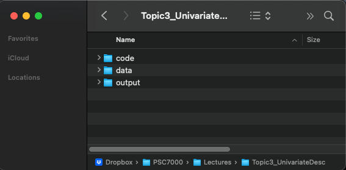

```{css,echo = F}
.small .remark-code { /*Change made here*/
  font-size: 85% !important;
}
.tiny .remark-code { /*Change made here*/
  font-size: 50% !important;
}
```

```{r,include=F}
set.seed(123)
options(width=60)
knitr::opts_chunk$set(fig.align='center',fig.width=9,fig.height=5,message=F,warning=F)
def.chunk.hook  <- knitr::knit_hooks$get("chunk")
knitr::knit_hooks$set(chunk = function(x, options) {
  x <- def.chunk.hook(x, options)
  ifelse(options$size != "normalsize", paste0("\n \\", options$size,"\n\n", x, "\n\n \\normalsize"), x)
})
```


# Today's Agenda

--

**Part I: Data Wrangling**

1. What is "data wrangling"?

2. Why `R`?

3. `tibbles` (table dataframes)

4. Political + data **science**

  - Michigan exit polls
  
--

**Part II: Univariate Analysis**

1. Definitions and scope

2. Opening and defining the data

3. Variable classes

4. Univariate description
  
---

# What is "data wrangling"?

<center></center>

--

- Preparing data for analysis

--

  - DANGER: Most important but least appreciated step!
  
---

# Danger!

--

- Data wrangling gone bad

--

<center></center>

---

# Danger!

- Data wrangling gone bad

<center></center>

---

# Danger!

- Data wrangling gone bad

<center></center>

---

# Danger!

- How do we avoid these mistakes?

--

- Three principles

--

  1. Replicability
  
--

  2. Understandability
  
--

  3. Robustness
  
--

- The big picture

--

  - Load **raw data** into an `RStudio` script
  
--

  - Wrangle the data within this script
  
--

  - Save a **new version** of the wrangled data with a **.red[different file name]**
  
--

- The point: Someone else should be able to recreate your work from scratch!
  
---

# Why `R`?

--

- Checks all three boxes

--

- But even `R` can be corrupted...

--

- ...with `Save workspace image`

--

- **.red[NEVER `Save workspace image`]**

--

  - If you do, the next time you open `R`, it will load the modified data
  
---

# NEVER SAVE WORKSPACE IMAGE

<center></center>


---

# NEVER SAVE WORKSPACE IMAGE

<center></center>

---

# Why `R`?

- **.green[ALWAYS]** start with an `empty environment`

--

  - How do you know if the environment is empty?

--

<center></center>

---

# Why `R`?

- **.green[ALWAYS]** start with an `empty environment`

  - How do you know if the environment is empty?

<center></center>

---

# Why `R`?

--

- `R` scripts or `RMarkDown` scripts should be: 

--

  1. Single purpose (but definitions can vary)

--

  2. Well-commented (make it easy for anyone to understand)
  
--

  3. Iteratively built (constant bug checking)
  
---

# Let's get started

--

- Set up three subfolders
  
--
  
<center></center>

--

- Download [`MI2020_ExitPoll.rds`](https://github.com/rweldzius/PSC7000_F2024/raw/main/Data/MI2020_ExitPoll.rds) to your `data` folder

---

# Pausing for .blue[science]

--

- What are these data?

--

- "Exit poll" data from Michigan in the fall of 2020

--

  - Polls fielded either on or just before an election
  
--

  - Used to understand *why* voters chose a candidate...
  
--

  - ...not to *predict* who will win (voting data is used for that)
  
---

# Michigan

--

- A "swing state" in 2020, following unexpected support for Trump in 2016

--

<center></center>

---

# Exit Polls

--

- These polls ask voters to check a box in response to a question

--

<center></center>

---

# Exit Polls

- These polls ask voters to check a box in response to a question

<center></center>


---

# Exit Polls

--

- **Predictive**: Use data to *predict* an outcome of interest.

--

  1. How many voters report voting for each candidate?
  2. What predicts support for Trump? For Biden?
  
--

- **Descriptive**: Use data to *describe* an event.

--

  1. How did Trump support vary by: gender? Age? Education?
  2. When did voters make up their minds?
  3. Why did voters support Trump or Biden?
  4. How do Trump and Biden voters vary in their opinions on: Covid? Race relations?
  
---

# Getting Started


- Open `RStudio` and `require(tidyverse)`

```{r,message=F,warning=F}
require(tidyverse)
require(labelled)
```

--

- Load the data. 
- Use: `MI_raw  <- read_rds('../data/MI2020_ExitPoll.rds')`

```{r}
MI_raw  <- read_rds('https://github.com/rweldzius/PSC7000_F2024/raw/main/Data/MI2020_ExitPoll.rds')
```

---

# Getting Started

- And take a look

```{r}
MI_raw
```

---

# Tabular Data

--

- Remember that we are using tabular data, where rows are observations (i.e., survey respondents) and columns are variables (i.e., vote choice)

--

- What is the **unit of observation** in these data?

--

  - Voters...which voters?
  
--

  - Voters in Michigan...all of them?
  
--

  - No just a random sample of those leaving the ballot box in 2020

---

# The Process: Steps 1-3

- Step 1: **Look** at the data

--

- Step 2: **Wrangle** the data

--

- Step 3: **Analyze** the data

---

# Step 1: Look at the data

- Goals:

--

1. Understand variable "types"

--

  - Most important: continuous versus categorical

--

2. Identify **missingness**: either `NA` or "unit non-response"

--

  - Unit non-response: observations who didn't provide information
  
--

3. Identify **skew** or other phenomena that require wrangling

--

  - Highly skewed data should be logged
  
  - Some variables should be transformed to **rates** or **proportions**

  
---

# Step 1: Look at the data

- Methods:

--

  1. Just look: see the first few rows and the first few columns
  
--

  2. `glimpse()`: see the first few rows for every column
  
--

  3. `summary()`: see the lowest, highest, mean, median, and quartiles, along with missingness (**better for continuous data**)
  
--

  4. `count()`: see the number of observations in each category (**categorical data only**)
  
---

# Step 1: Look at the data

```{r}
glimpse(MI_raw)
```

---

# Step 1-1: Variable Types

- **Continuous Variables**

--

  - `dbl`: numeric data stored with great precision. Can be manipulated with mathematical functions.
  
  - `int`: numeric data stored as integers. `R` typically treats `dbl` and `int` as interchangeable.
  
--

- **Categorical Variables**
  
  - `chr`: string data, consisting of letters (and/or numbers). **Cannot** be manipulated with mathematical functions.
  
  - `fct`: string data that is stored with a number. Typically used to define group membership.
  
--

- **Mixtures**
  
  - `lbl`: string data that is stored with a number. Similar to `fct` but less commonly occurring in base `R`.
  
---

# Step 1-2: Missingness

- Two ways to indicate an observation is missing data

--

  1. `NA` code
  
  2. Some bespoke code for "unit non-response" (often `9`, or `99`, or some large value ending in `9` that is dissimilar from the rest of the data)


---

# Step 1-2: Missingness

- To identify `NA`-style missingness, use `summary()`

```{r,error=TRUE}
summary(MI_raw %>% select(LALVOTERID,SEX,AGE10,PARTYID,LGBT,QLT20))
```

---

# Step 1-2: Missingness

- To identify unit non-response, can use `count()`

```{r}
MI_raw %>%
  count(PARTYID)
```

--

- The number `9` indicates unit non-response for `PARTYID`

---

# Step 1-2: Missingness

- To identify unit non-response, can use `count()`

```{r}
MI_raw %>%
  count(AGE10)
```

--

- The number `99` indicates unit non-response for `AGE10`


---

# Step 1-2: Missingness

- To identify unit non-response, can use `count()`

```{r}
MI_raw %>%
  count(LGBT)
```

--

- The number `9` indicates unit non-response for `LGBT` **AND** this variable also has `NA`


---

# Step 1-2: Missingness

- If the data isn't labelled, can still **look** to identify unit non-response

--

- Re-introducing...`ggplot()`

--

  - Only interested in **single variable**
  
--

- For now, we need two parts:

--

  1. `aes(x = [x-axis variable])`
  
  2. `geom_histogram()` (for continuous) or `geom_bar()` (for categorical)
  
---

# `ggplot()` Intro

```{r,message = F,warning = F,error=TRUE}
MI_raw %>%
  ggplot(aes(x = AGE10)) + 
  geom_bar()
```

---

# `ggplot()` Intro

```{r,message = F,warning = F}
MI_raw %>%
  ggplot(aes(x = LGBT)) + 
  geom_bar()
```

---

# `ggplot()` Intro

```{r,message = F,warning = F}
MI_raw %>%
  ggplot(aes(x = PARTYID)) + 
  geom_bar()
```

---

# Step 1-3: Skew & Transformations

- To identify **skew**, we will also need `ggplot()`

--

```{r,echo = F,message = F,warning = F}
tibble(`1 - Skewed` = exp(runif(n = 1000,min = 1,max = 10)),
           `2 - Somewhat Skewed` = exp(runif(n = 1000,min = 0,max = 2)),
           `3 - Not Skewed` = rnorm(n = 1000)) %>%
  gather(type,val) %>%
   ggplot(aes(x = val)) + 
   geom_histogram() + 
  facet_wrap(~type,scales = 'free') + 
  theme(axis.text = element_blank())
```

--

- We will return to this later

---

# Step 2: Wrangle

- Why wrangle data?

```{r}
MI_raw %>%
  summarise(avgAge = mean(AGE10,na.rm=T))
```


---

# Step 2: Wrangle

- We over-estimate the average age category because `R` doesn't realize these are codes!

```{r}
MI_raw %>%
  count(AGE10)
```

---


# Step 2: Wrangle

- We need to convert **codes** for missing data to `NA`

--

- Use `mutate()` and `ifelse()` to replace `99` with `NA`

--

- `mutate()`:

--

  - Either creates a new column
  
  - Or changes an existing column
  
--

- `ifelse()`:

--

  - Does exactly as it says
  
  - `ifelse([LOGIC],[VALUE IF TRUE],[VALUE IF FALSE])`
  
---

# Step 2: Wrangle

- If: `AGE10` is `99` (i.e., the unit non-response code)

--

- Then: give me an `NA` value

--

- Otherwise: give me whatever `AGE10` is

--

```{r}
MI_raw %>%
  mutate(AGE10_new = ifelse(AGE10 == 99,NA,AGE10)) %>%
  select(AGE10,AGE10_new) %>%
  slice(c(35,1:20)) # Don't need to know slice() yet, ignore
```


---

# Step 2: Wrangle

- The Assignment Operator (`<-`): `R`'s version of "Save As..."

--

- If we don't either:

--

  1. Overwrite the `MI_raw` object...
  
  2. Or create a new object...
  
--

  - `R` will not remember this new `AGE10_new` variable we created

--

```{r,error=T}
MI_raw %>% select(AGE10_new)
```

---

# Step 2: Wrangle

- Thus we need to use the **assignment operator** (`<-`)

```{r}
MI_final <- MI_raw %>%
  mutate(AGE10_new = ifelse(AGE10 == 99,NA,AGE10))

MI_final %>%
  select(AGE10,AGE10_new) %>%
  slice(c(35,1:20)) # Don't need to know slice() yet, ignore
```


---

# Step 2: Wrangle

- We can now get a more accurate measure of the average age category

--

```{r}
MI_final %>%
  summarise(avgAge = mean(AGE10_new,na.rm=T))
```

---

# Variable Classes

- **How should we interpret this number?**

--

  - Does this mean that the average age of respondents is 7?
  
--

  - **NO**: we want to keep the definitions!
  
---

# Converting to `chr`

- There is a helpful package called `haven` which will extract these labels as `factors` 

--

- Install it with `install.packages("haven")` but DON'T `require()` it

--

- We can call on useful functions without `require()` by using two `::`

--

```{r}
haven::as_factor(MI_final$AGE10) %>% head()
```

---

# Step 2: Wrangle

- Goal: Create a new column that converts the value for `AGE10` to a label

--

- To do this, use `mutate()` + the `haven::as_factor()` function + the `as.character()` function

--

  - Step 1: `as_factor()` function (from `haven`) converts to `fct` class
  
  - Step 2: `as.character()` function (from base `R`) converts to `chr` class

--

```{r}
MI_final <- MI_final %>%
  mutate(AGE10_labs = as.character(haven::as_factor(AGE10)))
```

--

- **NB:** we **overwrite** `MI_final` to **add** the new column `AGE10_labs`

---

# Step 2: Wrangle

```{r,fig.height=4}
MI_final %>%
  ggplot(aes(x = AGE10_labs)) + 
  geom_bar(stat = 'count')
```

---

# Aside on `geom_bar()`

- Default: `stat = "count"` means show total observations in each category

---

# Aside on `geom_bar()`

- Override: `stat = "identity"` forces to show a specific value set in `aes()`

--

```{r, fig.dim = c(8, 4)}
MI_final %>%
  count(AGE10_labs) %>%
  ggplot(aes(x = AGE10_labs,y = n)) + 
  geom_bar(stat = 'identity')
```


---

# Step 2: Wrangle

- Say we want the category labels for `PRSMI20`, `QLT20`, and `LGBT`

--

```{r,error = TRUE}
MI_final <- MI_final %>%
  mutate(preschoice = as.character(haven::as_factor(PRSMI20)),
         Qlty = as.character(haven::as_factor(QLT20)),
         LGBT_lab = as.character(haven::as_factor(LGBT)))

MI_final %>%
  select(preschoice,Qlty,LGBT_lab)
```


---

# Preparing a new `tibble`

- .blue[Science] guides us toward which variables to focus on

```{r}
names(MI_final)
```

---

# Let's Wrangle!

- We are interested in presidential vote choice (`PRSMI20` or `preschoice`) and the quality of the candidate the respondent likes most (`QLT20` or `Qlty`)

--

- Look at these first

```{r}
MI_final %>% select(preschoice,Qlty)
```


---

# Let's Wrangle!

- We can get some preliminary descriptive info with `count()`

```{r}
MI_final %>%
  count(preschoice)
```

---

# Let's Wrangle!

- We can get some preliminary descriptive info with `count()` (.blue[science!])

```{r}
MI_final %>%
  count(preschoice,SEX)
```

---

# Choosing the right function

- But `count()` is less useful for continuous variables

```{r}
MI_final %>%
  count(WEIGHT)
```

---

# Choosing the right function

- Use `summary()` instead

```{r}
MI_final %>%
  select(WEIGHT) %>%
  summary(WEIGHT)
```

---

# Let's Wrangle!

- Recall some of the other helpful functions in `tidyverse`

```{r}
MI_final %>%
  count(preschoice) %>%
  arrange(desc(n))
```


---

# Let's Wrangle!

- Let's look for missing data

```{r}
MI_final %>%
  count(Qlty)
```


---

# Let's Wrangle!

- Drop rows where the respondent didn't answer the "quality" question

```{r}
MI_final %>%
  drop_na(Qlty) %>%
  count(Qlty)
```

---

# Let's Wrangle!

- But we still have the `[DON'T READ] Don't know/refused` respondents

--

- Convert "unit non-response" codes to `NA`

--

  - Need to look at them first!

```{r}
MI_final %>%
  count(Qlty)
```

---

# Let's Wrangle!

- Convert "unit non-response" codes to `NA`

```{r}
MI_final <- MI_final %>%
  mutate(Qlty = ifelse(grepl("DON'T READ",Qlty),NA,Qlty))
MI_final %>%
  count(Qlty)
```

---

# Let's Wrangle!

- Drop rows where the respondent didn't answer the "quality" question

```{r}
MI_final %>%
  drop_na(Qlty) %>%
  count(Qlty)
```

---

# Let's Wrangle!

- This is equivalent to `filter(!is.na(Qlty))`

```{r}
MI_final %>%
  filter(!is.na(Qlty)) %>%
  count(Qlty)
```

---

# Aside on filtering `NA`

- Make sure to specify which column has the missing data!

--

- Otherwise get "complete cases" (respondents with no missing data)

```{r}
MI_final %>%
  drop_na() %>%
  count(QLT20)
```

--

- Same as

```{r}
MI_final %>%
  filter(complete.cases(.)) %>%
  count(QLT20)
```


---

# Let's Wrangle!

- Finally, let's subset the data to focus only on the other variables we are interested in


```{r}
MI_final <- MI_final %>%
  select(SEX,AGE10,PARTYID,
         WEIGHT,QRACEAI,EDUC18,LGBT,
         BRNAGAIN,LATINOS,RACISM20,
         QLT20,Qlty,PRSMI20,preschoice)
```

--

- This is our **wrangled** data

```{r}
MI_final
```


---

# Finishing up

--

- And now save both the raw data and our prepared data together

```{r}
save(MI_raw,MI_final,file = '../data/MI_prepped.RData')
```

--

- An `.RData` file can contain multiple objects

--

- When we load it, we get access to all the objects we've created

```{r}
rm(MI_raw,MI_final)

load('../data/MI_prepped.RData')
```

--

- **NB: different file extensions require different functions!**

--

  - `load` for `.RData` files
  
  - `read_rds` for `.rds` files
  
  - `read_csv` for `.csv` files


---


# Univariate Analysis: Definition

--

- .red[Uni] + .blue[variate]

--

  - .red[One] + .blue[variable]
  
--

  - Analysis of one variable
  
---

# Scope

- How to analyze a single variable?

--

- How to think .blue[scientifically]?

--

  - Typically, scientific theories concern more than one variable
  
--

  - I.e., education + wages; gender + voting

--

  - What might be a theory about education in isolation?
  
--

- Is there no point to univariate analysis?

---

# Univariate Analysis is **ESSENTIAL**

--

- Both from a .red[practical data] perspective...

--

  - Informs how we "wrangle" the data

--

- ...and from a .blue[scientific theory] perspective

--

  - Generates hypotheses
  
--

<center></centering>

---

# Set-up and Load Data

--

- As always, create your topic folder first

<center></center>

---

# Set-up and Load Data

- Open `R` via `RStudio` and `require(tidyverse)`

```{r,message = F}
require(tidyverse)
```

- Download data from [github](https://github.com/rweldzius/PSC7000_F2024/raw/main/Data/nba_players_2018.Rds)

- Save in your `data` folder

```{r}
nba <- read_rds('https://github.com/rweldzius/PSC7000_F2024/raw/main/Data/nba_players_2018.Rds')
```

---

# Introducing the data

--

- Data on every NBA player active in the 2018-2019 season

--


| Name               |                          Definition |
|--------------------|------------------------------------:|
| namePlayer         |                         Player name |
| idPlayer           |                    Unique player id |
| slugSeason         |                Season start and end |
| numberPlayerSeason |        Which season for this player |
| isRookie           |        Rookie season, true or false |
| slugTeam           |                     Team short name |
| idTeam             |                      Unique team id |
| gp                 |                        Games Played |
| ...                |                                 ... |


---

# Thinking like a .blue[scientist]

--

- What questions do we have? What hypotheses might we want answered?

--

- Overwhelming? Let's start simpler

--

- Total points (`pts`)

--

  - What does this measure?
  - What kind of variable is it?

```{r}
glimpse(nba %>% select(pts))
```


---

# Thinking like a .blue[scientist]

- How can we analyze a single variable?

--

- Want to **summarize** it somehow

--

  - For example, look at the `mean()` and the `median()`
  
```{r}
nba %>%
  summarise(mean_pts = mean(pts,na.rm=T),
            med_pts = median(pts,na.rm=T))
```

---

# Thinking like a .blue[scientist]

- Or we could summarise the overall distribution with `summary()`

--

```{r}
summary(nba$pts)
```

--

- In English:

--

  - There is at least one player who didn't score at all (`Min.`)
  
  - At least one player scored 2,818 points (`Max.`)
  
  - 25% of players scored less than 115 points (`1st Qu.`)
  
--

  - 25% of players scored more than ???
  
--

- What does a decimal mean here?
  
---

# Visualization

--

- We could try and remember all these statements

--

- Or we could just visualize the data

--

```{r,fig.height=4,fig.width=9,warning=F,message=F}
nba %>%
  ggplot(aes(x = pts)) + 
  geom_histogram()
```

---

# Visualization

- Plotting the histogram reveals some things!

--

  - There are **MANY** players who didn't score any points
  - There are **VERY FEW** who scored many
  
--

- We can combine the substantive interpretation with the visualization by plotting vertical lines for the quartiles

--

  - A "quartile" is 25% increments
  
--

  - A "decile" is 10% increments, a "quantile" is 20% increments
  
--

  - A "percentile" is 1% increments

---

# Visualization

```{r,fig.height=5,fig.width=9,warning=F,message=F}
nba %>%
  ggplot(aes(x = pts)) + 
  geom_histogram() + 
  geom_vline(xintercept = quantile(nba$pts,c(.25,.5,.75))) #<<
```

---

# Visualization

- We can save and update plots using the object assignment operator `<-`

```{r}
p <- nba %>%
  ggplot(aes(x = pts)) + 
  geom_histogram()

p <- p + geom_vline(xintercept = quantile(nba$pts,c(.25,.5,.75)),linetype = 'dashed',color = 'red')

p <- p + xlab('Total Points') + ylab('Number of Players')

p <- p + theme(panel.background = element_rect(fill = 'white'))

p <- p + labs(title = 'Points by Players',subtitle = '2018-2019 NBA Season')
```

---

# Visualization

```{r,fig.height=6,fig.width=10,warning=F,message=F}
p
```


---

# Visualization

- Let's add Caitlin Clark to this!

```{r}
p <- nba %>%
  ggplot(aes(x = pts)) + 
  geom_histogram()

p <- p + geom_vline(xintercept = quantile(nba$pts,c(.25,.5,.75)),linetype = 'dashed',color = 'red')

p <- p + geom_vline(xintercept = 761,linetype = 'dashed',color = 'blue') +
  annotate("text", x=950, y=90, label= "Caitlin Clark", color='blue')

p <- p + xlab('Total Points') + ylab('Number of Players')

p <- p + theme(panel.background = element_rect(fill = 'white'))

p <- p + labs(title = 'Points by Players',subtitle = '2018-2019 NBA Season')
```

---

# Visualization

```{r,fig.height=6,fig.width=10,warning=F,message=F}
p
```


---

# Visualization informs .blue[science]

--

- Looking at the data can help generate research questions, theories, and hypotheses

--

  - **Question:** Why do some players not score any points?
  
--

  - **Theory:** Players need minutes to score points.
  
--

  - **Hypothesis:** The number of points a player scores should be positively correlated with their minutes.

---

# Univariate Description

--

- Testing this hypothesis comes later

--

- For now, let's also describe the minutes variable

```{r}
summary(nba$minutes)
```

--

  - At minimum, every player played at least 1 minute
  
--

  - Does the distribution of this variable look similar to the points?
  
---

```{r,fig.height=6,fig.width=10,warning=F,message=F}
nba %>%
  ggplot(aes(x = minutes)) + 
  geom_histogram(alpha = .3) + 
  geom_vline(xintercept = quantile(nba$minutes,c(.25,.5,.75))) + 
  labs(title = 'Minutes by Players',subtitle = '2018-2019 NBA Season',x = 'Minutes Played',y = 'Number of Players')
```

---

# Other Variables

--

- Thus far, `pts` and `minutes` are both `dbl`

```{r}
glimpse(nba %>% select(pts,minutes))
```

--

- What about other variable types?

---

# Other Variabes

```{r}
glimpse(nba)
```

---

# Categorical Variables

--

- Already introduced you to `dbl`, `fct`, `chr` and `int`

--

- Taking a step back: Outside `R`, data science uses "categorical" variables

--

  1. Mutually exclusive: observations can only be in one category
  2. Exhaustive: every observation is assigned to a category
  
--

- For example, `isRookie`

--

  1. Mutually exclusive: Players are either in their rookie season in 2018-2019, or are not
  2. Exhaustive: these categories define every player in the data
  
---

# Categorical Variables

- Categorical variables can be divided into the following sub-types

--

- **Ordered:** There is a sensible order (i.e., education)

--

  - Should be arranged intuitively (i.e., LTHS, HS Degree, Some coll, etc.)
  
--

  - To summarize, calculate the proportions for each category.
  
--

  - If there are too many categories, use the "mode"

  
---

# Categorical Variables

- Categorical variables can be divided into the following sub-types

- **Ordered, Binary:** An ordered categorical variable with just two levels

--

  - Should be arranged in intuitive order (i.e., is not a rookie / is a rookie)
  
--

  - To summarize, just convert to a [0,1] number and take the mean

---

# Categorical Variables

- Categorical variables can be divided into the following sub-types

- **Unordered**: No sensible order of categories (i.e., major degree)

--

  - Order by most commonly occurring categories
  
--

  - As before, use the mode for too many categories

---

# Categorical Variables

- Categorical variables can be divided into the following sub-types

- **Unordered, Binary**: No sensible order and only two levels

---

# Categorical Variables

- Categorical variables are meaningfully different from continuous variables

--

  - Continuous variables are ordered and can theoretically be divided into arbitrarily small measures
  
--

  - Technically can be defined as either **interval** or **ratio** variables
  
--

  - In practice, we rarely worry about this distinction, but we **DO** care about continuous versus categorical variables

---

# Categorical Variables

- `fct` is a class that is unique to `R`

--

  - Meant for ordered categorical variables
  
--

  - `fct` stores the order and assigns a numeric value + a definition
  
--

  - Most of the time, better to store as a `chr` (but not always)
  
---

# Variables

- `R` may store categorical variables as `chr`, `fct`, `lgl`, `int`, or even `dbl`

--

- Continuous variables typically stored as `int` or `dbl`

--

- Up to the data scientist to look at the data and determine

--

- Simple **process**

--

  1. Look at a few observations and make a guess about the variable type
  2. Create a plot or table based on that guess
  3. If the result is sensible, proceed. Otherwise go back to #1.
  
---

# In Practice

--

- Let's look at field goals (`fgm`)

--

- What type of variable should this be?

--

  - *Technically* not continuous, since it can't be divided into fractions (i.e., what is 35.5 field goals?)
  
--

  - But we typically don't care about this distinction
  
--

  - We just want to make sure it is not a categorical variable (i.e., less than 20 FGs, 20-40 FGs...etc. would be categorical)
  
--

- To check, follow the process!

---

# The Process: #1 Look

```{r}
nba %>% 
  select(namePlayer,slugTeam,fgm) %>%
  arrange(-fgm)
```

---

# The Process: #2 Create

```{r,fig.width=9,fig.height=5}
nba %>%
  ggplot(aes(x = fgm)) + 
  geom_density()
```

---

# The Process: #3 Evaluate

--

- Looks like a continuous variable to me!

--

- Summarize it!

--

```{r}
nba %>%
  summarise(mean_fg = mean(fgm,na.rm=T),
            med_fg = median(fgm,na.rm=T))
```

--

- `mean()` is more easily understood, but more sensitive to outliers

- `median()` is harder to explain to a general audience, but more sensible when there are outliers

---

# Another example

--

- Player age

--

- What kind of variable do we think this might be?

--

  - Continuous? It is ordered and divisible to arbitrary fractions! (Just ask any 6 and three quarters year old)
  
--

  - But is it also useful to think of it as a categorical? In the context of NBA players, there aren't many categories!
  
--

- Time for the **process**!

---

# The Process: #1 Look

```{r}
nba %>%
  select(namePlayer,agePlayer) %>%
  arrange(-agePlayer)
```

---

# The Process: #2 Create

```{r,fig.width=9,fig.height=5}
nba %>%
  ggplot(aes(x = agePlayer)) + 
  geom_density()
```

---

# The Process: #2 Create

```{r,fig.width=9,fig.height=5}
nba %>%
  ggplot(aes(x = factor(agePlayer))) + 
  geom_bar(stat = 'count')
```

---

# The Process: #2 Create

<center></center>

---

# The Process: #3 Evaluate

```{r}
quantile(nba$agePlayer,c(.1,.25,.5,.75,.9,.95))
```

---

# Some more examples!

--

- Which of these variables is an unordered categorical variable?

--

- Follow the process and calculate which category in this variable is the most commonly occurring

```{r}
# INSERT CODE HERE
```

---

# Career Prior to NBA (`org`)

--

- If you chose this as your unordered categorical variable, you probably saw something like the following in step #1 of the process

```{r}
nba %>%
  count(org) %>%
  arrange(-n)
```

---

# Career Prior to NBA (`org`)

- The most commonly occurring categories are `NA` and `Other`!

--

- Wrangle some data and re-calculate

```{r}
nba %>%
  filter(!is.na(org)) %>%
  filter(org != 'Other') %>%
  count(org) %>%
  arrange(-n)
```

---


# Categorical: Unordered, Binary (`idConference`)

- Example of the default variable class (`dbl`) not corresponding to the type of variable (unordered binary)

--

- Should wrangle into something better

```{r}
nba <- nba %>%
  mutate(west_conference = ifelse(idConference == 1,1,0))

nba %>%
  summarise(propWest = mean(west_conference))
```

---

# A Preview of Multivariate Analysis

--

- Let's take a "conditional mean"

--

  - I.e., conditional on players going to Kentucky, how many points did NBA players score in the 2018-2019 season?
  
--

  - (Simpler is just to say "how many points did NBA players who went to Kentucky score?")
  
- Recall the `group_by()` command

---

# A Preview of Multivariate Analysis

```{r}
nba %>%
  filter(!is.na(org)) %>%
  filter(org != 'Other') %>%
  group_by(org) %>%
  summarise(tot_pts = sum(pts,na.rm=T))
```

---

# A Preview of Multivariate Analysis

--

- Some non-college organizations snuck in there

--

  - `Anadolu Efes S.K.` is a professional Turkish basketball team
  
---

# A Preview of Multivariate Analysis

```{r}
nba %>%
  filter(!is.na(org)) %>%
  filter(org != 'Other') %>%
  filter(!str_detect(org,"CB|KK|rytas|FC|B.C.|S.K.|Madrid")) %>%
  group_by(org) %>%
  summarise(tot_pts = sum(pts,na.rm=T))
```

---

# Another Preview

--

- Do the same but for free throw percentage (`pctFT`)

--

- **NB**: should you summarise with `sum()` or `mean()`? Why?


```{r}
# INSERT CODE HERE
```

---

# Conclusion

--

- What you need to know from today

  1. Why `RStudio` + `R` are great for **wrangling**
  
  2. `mutate()`

  3. `ifelse()`

  4. Assignment Operator ("Save As..."): `<-`
  
  5. **The Process**: look, create, evaluate
  
---

# Homework & Problem Set

- **Homework:**
  
  1. Work through psc7000_hw_3.Rmd
  
- **Problem Set:**  
  
  2. Problem Set 2 due Friday by midnight
