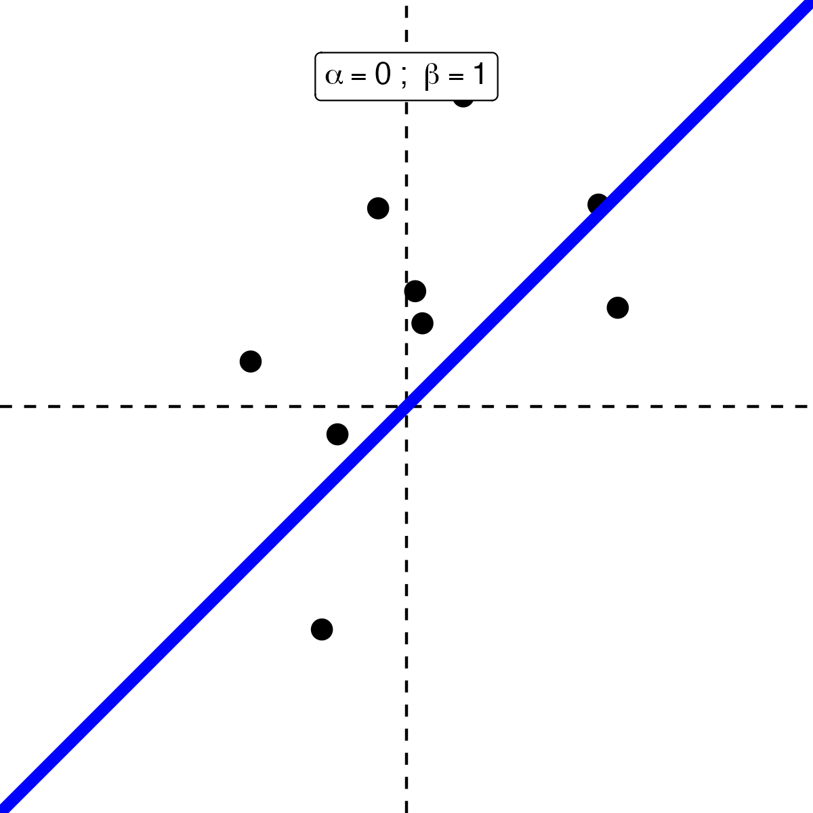
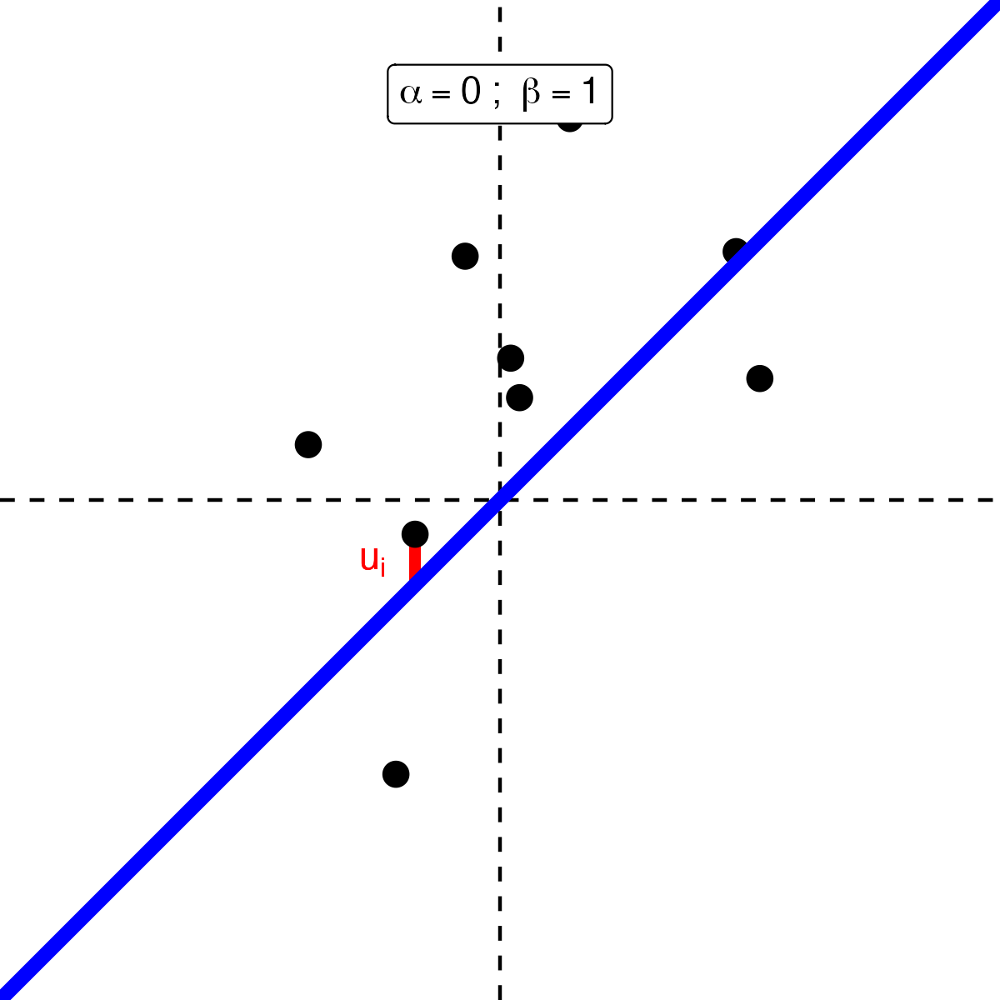
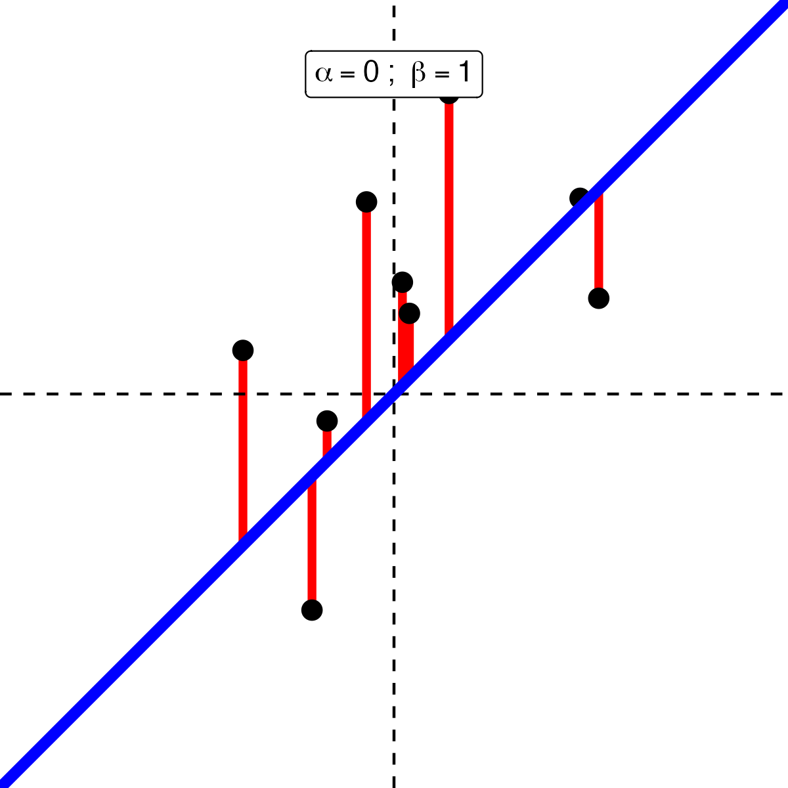
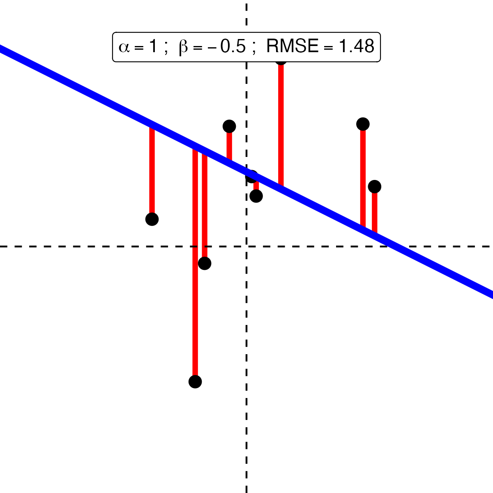
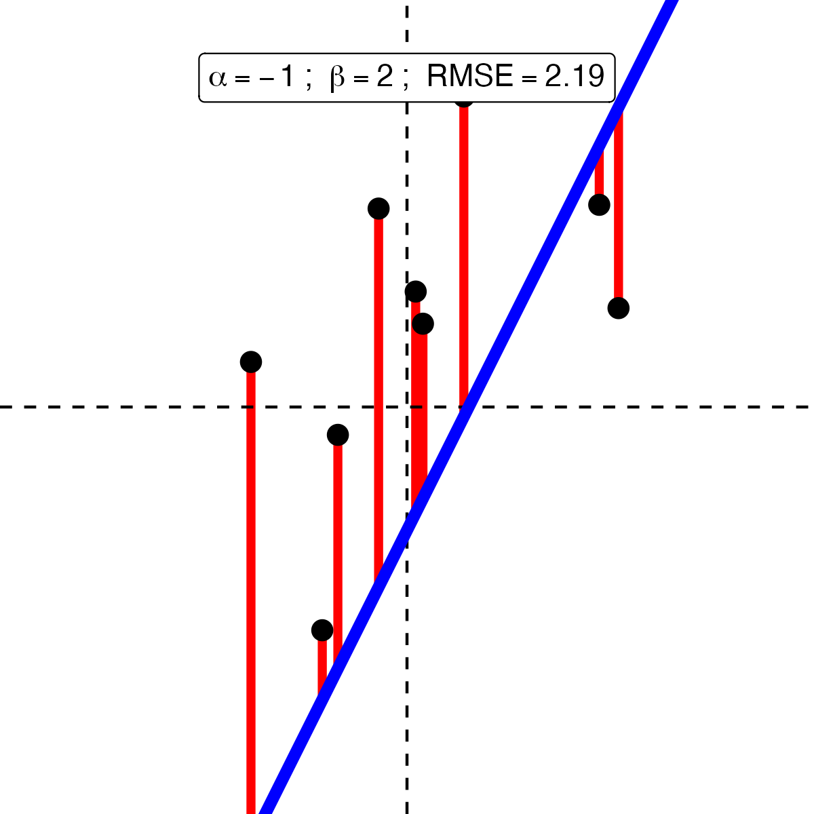
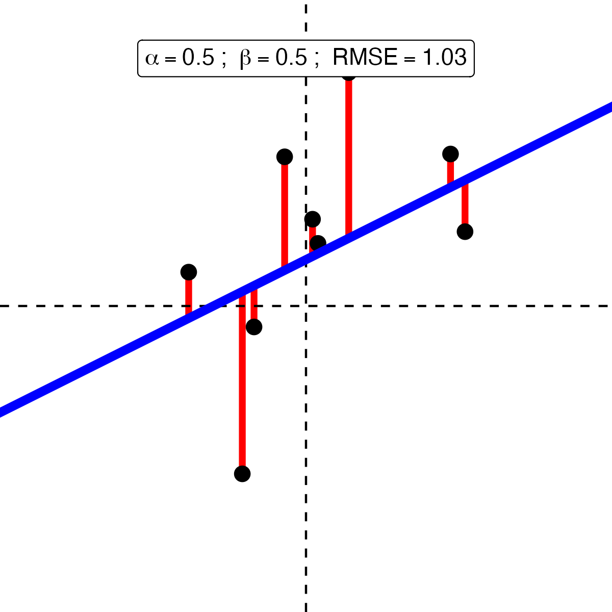

```{css,echo = F}
.small .remark-code { /*Change made here*/
  font-size: 85% !important;
}
.tiny .remark-code { /*Change made here*/
  font-size: 50% !important;
}
```

```{r,include=F}
set.seed(123)
options(width=60)
knitr::opts_chunk$set(fig.align='center',fig.width=9,fig.height=5,message=F,warning=F)
def.chunk.hook  <- knitr::knit_hooks$get("chunk")
knitr::knit_hooks$set(chunk = function(x, options) {
  x <- def.chunk.hook(x, options)
  ifelse(options$size != "normalsize", paste0("\n \\", options$size,"\n\n", x, "\n\n \\normalsize"), x)
})
```

# Agenda

1. Modeling Conditional Variation

2. Adding Regression to the **Process**

3. Introducing the Data

4. Demonstrating Regressions

5. Skew, logs, and coefficients

6. Evaluating a regression: Univariate and multivariate visualization of errors

7. Root Mean Squared Error (RMSE)

8. Cross Validation

---

# Regression & Conditional Analysis

--

- Recall our discussion of **conditional** analysis

--

  - Conditional &rarr; **depends on**
  
--

  - Analyze with **conditional means**
  
---

# Reminder of the **Process**

--

1. Determine variable **type**

--

  - I.e., categorical (ordered, unordered, binary) or continuous
  
  - In `R` terms: `chr`, `fct` for categorical, `dbl` for continuous
  
--

2. Type informs **univariate analysis**

--

  - I.e., histograms for continuous, barplots for categorical
  
--

3. Combination of types informs **conditional analysis**

--

  - Categorical X Categorical: proportions by categories (`geom_bar`)
  
  - Binary X Continuous: histograms by categories (`geom_histogram` / `geom_density`)
  
  - Categorical X Continuous: distributions by categories (`geom_boxplot` / `geom_violin`)
  
  - Continuous X Continuous: scatter plots (`geom_point`)
  
---

# What is regression?

--

- Conditional means for continuous data

--

<center></center>

---

# What is regression?

- People with hourly wages < $20 spend ~$50 on entertainment per week

<center></center>

---

# What is regression?

- People with hourly wages > $40 spend ~$95 on entertainment per week

<center></center>

---

# What is regression?

- .blue[Theory]: the more you earn, the more you spend

<center></center>

---

# What is regression?

- But **conditional means** make a lot of mistakes. Can we do better?

<center></center>


---

# What is regression?

- But **conditional means** make a lot of mistakes. Can we do better?

<center></center>


---

# Regression

--

- Calculating a **line** that minimizes mistakes *for every observation*

--

  - NB: could be a curvey line! For now, just assume straight
  
--

- Recall from geometry how to graph a straight line

--

- $Y = a + bX$

  - $a$: the "intercept" (where the line intercepts the y-axis)
  - $b$: the "slope" (how much $Y$ changes for each increase in $X$)

--

- (Data scientists use $\alpha$ and $\beta$ instead of $a$ and $b$ b/c nerds)

--

- Regression analysis simply chooses the best line

--

  - "Best"?

--

  - The line that minimizes the mistakes (the **line of best fit**)

---

# Linear Regression

```{r,message=F,warning=F,echo=F}
set.seed(123)
require(tidyverse)

X <- rnorm(9)
Y <- .5 + .5*X + rnorm(9)
p <- data.frame(X = X,Y = Y) %>%
  ggplot(aes(x = X,y = Y)) + 
  geom_point(size = 3) + 
  geom_vline(xintercept = 0,linetype = 'dashed') + 
  geom_hline(yintercept = 0,linetype = 'dashed') + 
  theme_void() + 
  lims(x = c(-3,3),y = c(-3,3))

ggsave(plot = p,filename = paste0('./scaffolding/regPlotFirst_0.png'),device = 'png',width = 4,height = 4)
```

.leftcol[

<center></center>

]

.rightcol[


]

---

# Linear Regression

```{r,message=F,warning=F,echo=F}
p <- data.frame(X = X,Y = Y) %>%
  ggplot(aes(x = X,y = Y)) + 
  geom_point(size = 3) + 
  geom_vline(xintercept = 0,linetype = 'dashed') + 
  geom_hline(yintercept = 0,linetype = 'dashed') + 
  theme_void() +
  geom_abline(intercept = 0,slope = 1,color = 'blue',size = 2) + 
  lims(x = c(-3,3),y = c(-3,3)) + 
  # annotate(geom = 'rect',xmin = -.5,ymin = .5,xmax = .5,ymax = 1) + 
  annotate(geom = 'label',x = 0,y = Inf,label = list(bquote(alpha==0~'; '~beta==1)),vjust = 2.1,parse = T)
ggsave(plot = p,filename = paste0('./figs/regPlotFirst_1.png'),device = 'png',width = 4,height = 4)
```

.leftcol[

<center></center>

]

.rightcol[


]
---

# Linear Regression

```{r,message=F,warning=F,echo=F}
p <- data.frame(X = X,Y = Y) %>%
  ggplot(aes(x = X,y = Y)) + 
  geom_segment(x = X[1],y = Y[1],xend = X[1],yend = X[1],color = 'red',size = 1.5) + 
  geom_point(size = 3) + 
  geom_vline(xintercept = 0,linetype = 'dashed') + 
  geom_hline(yintercept = 0,linetype = 'dashed') + 
  theme_void() + 
  geom_abline(intercept = 0,slope = 1,color = 'blue',size = 2) + 
  annotate(geom = 'text',x = X[1],y = Y[1],hjust = 2.1,vjust = 1.5,label = bquote(u[i]),color = 'red') + 
  lims(x = c(-3,3),y = c(-3,3)) + 
    annotate(geom = 'label',x = 0,y = Inf,label = list(bquote(alpha==0~'; '~beta==1)),vjust = 2.1,parse = T)
ggsave(plot = p,filename = paste0('./figs/regPlotFirst_2.png'),device = 'png',width = 4,height = 4)
```

.leftcol[

<center></center>

]

.rightcol[

- **Error/Residual**: mistake made by a line

  - In math: $u_i = y_i - \hat{y}_i$
  
  - In English: difference between true outcome value ( $y_i$ ) and prediction ( $\hat{y}_i$ )

]

---

# Linear Regression

```{r,message=F,warning=F,echo=F}
RMSE <- sqrt(mean((Y - (X*1 + 0))^2))
p <- data.frame(X = X,Y = Y) %>%
  ggplot(aes(x = X,y = Y)) + 
  geom_segment(x = X,y = Y,xend = X,yend = X,color = 'red',size = 1.5) + 
  geom_point(size = 3) + 
  geom_vline(xintercept = 0,linetype = 'dashed') + 
  geom_hline(yintercept = 0,linetype = 'dashed') + 
  theme_void() + 
  geom_abline(intercept = 0,slope = 1,color = 'blue',size = 2) + 
  lims(x = c(-3,3),y = c(-3,3)) + 
  annotate(geom = 'label',x = 0,y = Inf,label = list(bquote(alpha==0~'; '~beta==1)),vjust = 2.1,parse = T)
ggsave(plot = p,filename = paste0('./figs/regPlotFirst_3.png'),device = 'png',width = 4,height = 4)
```

.leftcol[

<center></center>

]

.rightcol[

- Use **errors** to find **line of best fit**

- **RMSE** (**R**oot **M**ean **S**quared **E**rror)

  - Square the errors
  
  - Take their average
  
  - Take the square root
  
- **RMSE** = `r round(RMSE,2)`

]

---

# Linear Regression

```{r,message=F,warning=F,echo=F}
a <- 1
b <- -.5
RMSE <- sqrt(mean((Y - (X*b + a))^2))
p <- data.frame(X = X,Y = Y) %>%
  ggplot(aes(x = X,y = Y)) + 
  geom_segment(x = X,y = Y,xend = X,yend = X*b+a,color = 'red',size = 1.5) + 
  geom_point(size = 3) + 
  geom_vline(xintercept = 0,linetype = 'dashed') + 
  geom_hline(yintercept = 0,linetype = 'dashed') + 
  theme_void() + 
  geom_abline(intercept = a,slope = b,color = 'blue',size = 2) + 
  lims(x = c(-3,3),y = c(-3,3)) + 
  annotate(geom = 'label',x = 0,y = Inf,label = list(bquote(alpha==.(a)~'; '~beta==.(b)~'; '~RMSE==.(round(RMSE,2)))),vjust = 2.1,parse = T)
ggsave(plot = p,filename = paste0('./figs/regPlotFirst_4.png'),device = 'png',width = 4,height = 4)
```

.leftcol[

<center></center>

]

.rightcol[

- Use **errors** to find **line of best fit**

- **RMSE** (**R**oot **M**ean **S**quared **E**rror)

  - Square the errors
  
  - Take their average
  
  - Take the square root
  
- **RMSE** = `r round(RMSE,2)`

]

---

# Linear Regression

```{r,message=F,warning=F,echo=F}
a <- -1
b <- 2
RMSE <- sqrt(mean((Y - (X*b + a))^2))
p <- data.frame(X = X,Y = Y) %>%
  ggplot(aes(x = X,y = Y)) + 
  geom_segment(x = X,y = Y,xend = X,yend = X*b+a,color = 'red',size = 1.5) + 
  geom_point(size = 3) + 
  geom_vline(xintercept = 0,linetype = 'dashed') + 
  geom_hline(yintercept = 0,linetype = 'dashed') + 
  theme_void() + 
  geom_abline(intercept = a,slope = b,color = 'blue',size = 2) + 
  lims(x = c(-3,3),y = c(-3,3)) + 
  annotate(geom = 'label',x = 0,y = Inf,label = list(bquote(alpha==.(a)~'; '~beta==.(b)~'; '~RMSE==.(round(RMSE,2)))),vjust = 2.1,parse = T)
ggsave(plot = p,filename = paste0('./figs/regPlotFirst_5.png'),device = 'png',width = 4,height = 4)
```

.leftcol[

<center></center>

]

.rightcol[

- Use **errors** to find **line of best fit**

- **RMSE** (**R**oot **M**ean **S**quared **E**rror)

  - Square the errors
  
  - Take their average
  
  - Take the square root
  
- **RMSE** = `r round(RMSE,2)`

]


---

# Linear Regression

```{r,message=F,warning=F,echo=F}
a <- .5
b <- .5
RMSE <- sqrt(mean((Y - (X*b + a))^2))
p <- data.frame(X = X,Y = Y) %>%
  ggplot(aes(x = X,y = Y)) + 
  geom_segment(x = X,y = Y,xend = X,yend = X*b+a,color = 'red',size = 1.5) + 
  geom_point(size = 3) + 
  geom_vline(xintercept = 0,linetype = 'dashed') + 
  geom_hline(yintercept = 0,linetype = 'dashed') + 
  theme_void() + 
  geom_abline(intercept = a,slope = b,color = 'blue',size = 2) + 
  lims(x = c(-3,3),y = c(-3,3)) + 
  annotate(geom = 'label',x = 0,y = Inf,label = list(bquote(alpha==.(a)~'; '~beta==.(b)~'; '~RMSE==.(round(RMSE,2)))),vjust = 2.1,parse = T)
ggsave(plot = p,filename = paste0('./figs/regPlotFirst_6.png'),device = 'png',width = 4,height = 4)
```

.leftcol[

<center></center>

]

.rightcol[

- Use **errors** to find **line of best fit**

- **RMSE** (**R**oot **M**ean **S**quared **E**rror)

  - Square the errors
  
  - Take their average
  
  - Take the square root
  
- **RMSE** = `r round(RMSE,2)`

]

---

# Visual Intuition

<center></center>


---

# Visual Intuition

<center></center>

---

# Regression

--

- The line is .blue[substantively meaningful]

--

- Red line on scatter plot of spending and wages: $Y = 12 + 2*X$

--

- $\alpha$ tells us the value of $Y$ when $X$ is zero

--

  - People who don't make any money spend $12 per week on entertainment
  
--

- $\beta$ tells us how much $Y$ increases for each additional $X$

--

  - People spend an additional $2 per week for each additional $1 in hourly wages
  
---

# Regression

- These are called **"linear models"**

--

  - **Not** because the line is straight (it might not be)
  
  - but because the components are additive ( $\alpha + \beta X$ )
  
--

- Can extend to multiple predictors ( $X$ 's)

--

  - $Y = \alpha + \beta_1 X_1 + \beta_2 X_2 + \dots + \varepsilon$
  
--

  - $X_1$ might be wages and $X_2$ might be age (for example)
  
--

  - The final term $\varepsilon$ measures how bad our mistakes are
  
---

# Regression

--

- Let's demonstrate with the `debt` data

```{r,message = F,warning=F}
require(tidyverse)

debt <- read_rds('https://github.com/rweldzius/psc7000_F2024/raw/main/Data/sc_debt.Rds')

glimpse(debt)
```

---

# Research Camp

- .blue[Research Question]: What is the relationship between SAT scores and median future earnings?

--

- .blue[Theory]: Students with higher SAT scores work harder and have learned more. Employers reward these attributes with higher wages in the private market.

--

- .blue[Hypothesis]: The relationship between SAT scores and future earnings should be positive.

--

  - **NB**: Important caveats to this simplistic theory!
  
--

  - Socioeconomic status: predicts both higher SAT scores and higher wages
  
--

  - **Correlation $\neq$ Causation**
  
---

# Set Up

- Linking .blue[Theory] to .red[Data]

--

- Our SAT scores are theorized to explain future earnings

--

  - Thus the SAT scores are the independent / explanatory / predictor variable $X$
  
  - And earnings are the dependent / outcome variable $Y$

---

# Regression

- There is a simple recipe to follow

--

- And it is exactly how the syllabus for the class is designed!

--

  1. Look at your data to identify missingness (**Wrangling: Lecture 5**)
  
  2. **Univariate** visualization of your variables (**Lecture 6**)
  
  3. **Multivariate** visualization of your variables (**Lectures 7-10**)
  
  4. **Regression** (today)
  
  5. Evaluation of **errors** (next lecture)

---

# Step 1: Look

- Why worry about **missingness**?

--

1. **Substantive:** external validity

2. **Technical:** cross validation won't work! (Wednesday's lecture)

--

```{r}
summary(debt %>% select(sat_avg,md_earn_wne_p6))
```

---

# Step 2: Univariate Viz

- Why visualize both $Y$ and $X$?

--

1. **Substantive:** *See* which units you are talking about

2. **Technical:** Adjust for *skew*

---

# Step 2: Univariate Viz

- Why visualize both $Y$ and $X$?

```{r,warning=F,message=F}
debt %>%
  ggplot(aes(x = sat_avg)) + 
  geom_histogram()
```

---

# Step 2: Univariate Viz

- Why visualize both $Y$ and $X$?

```{r,warning=F,message=F}
debt %>%
  ggplot(aes(x = md_earn_wne_p6)) + 
  geom_histogram()
```

---

# Step 3: Multivariate 

- Eyeball the relationship first!

--

```{r,warning=F,message=F}
debt %>%
  ggplot(aes(x = sat_avg,y = md_earn_wne_p6)) + 
  geom_point()
```

---

# Step 3: Multivariate Viz

- Adding regression line

```{r,warning=F,message = F}
debt %>%
  ggplot(aes(x = sat_avg,y = md_earn_wne_p6)) + 
  geom_point() + geom_smooth(method = 'lm',se = F)
```

---

# Step 3: Multivariate Viz

- Let's focus on two schools

```{r,warning=F,message=F}
toplot <- debt %>%
  mutate(hl = ifelse(unitid %in% c(100654,179265),'hl','none')) # Choosing two examples
p2 <- toplot %>%
  ggplot(aes(x = sat_avg, y = md_earn_wne_p6,color = hl,group = 1,alpha = hl)) + 
  geom_point(data = toplot %>% filter(hl == 'none')) + 
  geom_point(data = toplot %>% filter(hl == 'hl'),size =3) + 
  scale_alpha_manual(values = c(1,.3)) + 
  scale_color_manual(values = c('red','black')) + 
  geom_smooth(method = 'lm',se = F) + 
  theme(legend.position = 'none') + 
  labs(title = "Graduate Earnings and SAT Scores",
       subtitle = "By School",
       x = "Average SAT Score",
       y = "Median Earnings of Grads")
```

---

# Step 3: Multivariate Viz

- Adding regression line

```{r,warning=F,message=F}
p2
```

---

# Step 3: Multivariate Viz

- Defining $\varepsilon$

```{r,warning=F,message=F}
p3 <- toplot %>%
  ggplot(aes(x = sat_avg, y = md_earn_wne_p6,color = hl,group = 1,alpha = hl)) + 
  geom_point(data = toplot %>% filter(hl == 'none')) + 
  geom_point(data = toplot %>% filter(hl == 'hl'),size =3) + 
  scale_alpha_manual(values = c(1,.3)) + 
  scale_color_manual(values = c('red','black')) + 
  geom_smooth(method = 'lm',se = F) + 
  annotate(geom = 'segment',
           x = toplot %>% filter(hl == 'hl') %>% .$sat_avg,
           y = toplot %>% filter(hl == 'hl') %>% .$md_earn_wne_p6,
           xend = toplot %>% filter(hl == 'hl') %>% .$sat_avg,
           yend = c(27500,41000),color = 'red',lwd = 1.2) + 
  theme(legend.position = 'none') + 
  labs(title = "Graduate Earnings and SAT Scores",
       subtitle = "By School",
       x = "Average SAT Score",
       y = "Median Earnings of Grads")
```

---

# Step 3: Multivariate Viz

- Measuring errors

```{r,warning=F,message=F}
p3
```
---

# The Data Scientist's Trade-off

--

- Those mistakes seem pretty big!

--

- Why not use a curvier line?

```{r,echo = F}
p4 <- toplot %>%
  ggplot(aes(x = sat_avg, y = md_earn_wne_p6,color = hl,group = 1,alpha = hl)) + 
  geom_point(data = toplot %>% filter(hl == 'none')) + 
  geom_point(data = toplot %>% filter(hl == 'hl'),size =3) + 
  scale_alpha_manual(values = c(1,.3)) + 
  scale_color_manual(values = c('red','black')) + 
  geom_smooth(method = 'gam',se = F) + 
  annotate(geom = 'segment',
           x = toplot %>% filter(hl == 'hl') %>% .$sat_avg,
           y = toplot %>% filter(hl == 'hl') %>% .$md_earn_wne_p6,
           xend = toplot %>% filter(hl == 'hl') %>% .$sat_avg,
           yend = c(27500,41000),color = 'red',lwd = 1.2) + 
  theme(legend.position = 'none') + 
  labs(title = "Graduate Earnings and SAT Scores",
       subtitle = "By School",
       x = "Average SAT Score",
       y = "Median Earnings of Grads")

p5 <- toplot %>%
  ggplot(aes(x = sat_avg, y = md_earn_wne_p6,color = hl,group = 1,alpha = hl)) + 
  geom_point(data = toplot %>% filter(hl == 'none')) + 
  geom_point(data = toplot %>% filter(hl == 'hl'),size =3) + 
  scale_alpha_manual(values = c(1,.3)) + 
  scale_color_manual(values = c('red','black')) + 
  geom_smooth(method = 'loess',se = F,span = .1) + 
  annotate(geom = 'segment',
           x = toplot %>% filter(hl == 'hl') %>% .$sat_avg,
           y = toplot %>% filter(hl == 'hl') %>% .$md_earn_wne_p6,
           xend = toplot %>% filter(hl == 'hl') %>% .$sat_avg,
           yend = c(26500,43000),color = 'red',lwd = 1.2) + 
  theme(legend.position = 'none') + 
  labs(title = "Graduate Earnings and SAT Scores",
       subtitle = "By School",
       x = "Average SAT Score",
       y = "Median Earnings of Grads")

p6 <- toplot %>%
  ggplot(aes(x = sat_avg, y = md_earn_wne_p6,color = hl,group = 1,alpha = hl)) + 
  geom_point(data = toplot %>% filter(hl == 'none')) + 
  geom_point(data = toplot %>% filter(hl == 'hl'),size =3) + 
  scale_alpha_manual(values = c(1,.3)) + 
  scale_color_manual(values = c('red','black')) + 
  geom_smooth(method = 'loess',se = F,span = .025) + 
  annotate(geom = 'segment',
           x = toplot %>% filter(hl == 'hl') %>% .$sat_avg,
           y = toplot %>% filter(hl == 'hl') %>% .$md_earn_wne_p6,
           xend = toplot %>% filter(hl == 'hl') %>% .$sat_avg,
           yend = c(26500,43000),color = 'red',lwd = 1.2) + 
  theme(legend.position = 'none') + 
  labs(title = "Graduate Earnings and SAT Scores",
       subtitle = "By School",
       x = "Average SAT Score",
       y = "Median Earnings of Grads")

p7 <- toplot %>%
  ggplot(aes(x = sat_avg, y = md_earn_wne_p6,color = hl,group = 1,alpha = hl)) + 
  geom_point(data = toplot %>% filter(hl == 'none')) + 
  geom_point(data = toplot %>% filter(hl == 'hl'),size =3) + 
  scale_alpha_manual(values = c(1,.3)) + 
  scale_color_manual(values = c('red','black')) + 
  geom_line(color = 'black') + 
  theme(legend.position = 'none') + 
  labs(title = "Graduate Earnings and SAT Scores",
       subtitle = "By School",
       x = "Average SAT Score",
       y = "Median Earnings of Grads")
```

---

# The Data Scientist's Trade-off

- Those mistakes seem pretty big!

- Why not use a curvier line?

```{r,warning=F,message=F,echo = F}
p4
```

---

# The Data Scientist's Trade-off

- Those mistakes seem pretty big!

- Why not use a curvier line?

```{r,warning=F,message=F,echo = F}
p5
```

---

# The Data Scientist's Trade-off

- Those mistakes seem pretty big!

- Why not use a curvier line?

```{r,warning=F,message=F,echo = F}
p6
```

---

# The Data Scientist's Trade-off

- Those mistakes seem pretty big!

- Why not use a curvier line?

```{r,warning=F,message=F,echo = F}
p7
```

---

# The Data Scientist's Trade-off

--

- Want to **reduce complexity**

--

- But also want to be **accurate**

--

- What is the right answer?

--

  - It depends on your .blue[theory] and the .red[data]
  
--

  - It is context-dependent
  
--

- And this is still only using *linear regression models*!

--

  - This is a deep area of study, for those interested
  

---

# Step 4: Regression

- Introducing the `lm(formula,data)` function

--

- Two inputs to care about:

--

  - `formula`: Code for $Y = \alpha + \beta X$
  
  - `data`: What is the data we are using?
  
- `formula` is written as `Y ~ X`

--

  - `R` will calculate $\alpha$ and $\beta$ for us
  
  - Just need to tell it what is $Y$ (`md_earn_wne_p6`) and $X$ (`sat_avg`)
  
  - The tilde (`~`) is `R`'s version of the equals sign
  
--

- Save the model to an object

```{r}
model_earn_sat <- lm(formula = md_earn_wne_p6 ~ sat_avg,data = debt)
```

---

# Step 4: Interpretation

- What is in this object?

--

- The regression results! Look at them with `summary()`

```{r}
summary(model_earn_sat)
```

---

# Step 4: Interpretation

- Starting with the first column called `Estimate`

--

- 1st Row `(Intercept)` is $\alpha$: the predicted value of $Y$ when $X$ is zero

--

  - Schools with average SAT scores of 0 produce graduates who earn -$12,053.87
  
  - Sensible?
  
--

- 2nd Row `sat_avg` is the $\beta$: the increase in $Y$ when $X$ increases by one

--

  - For each unit increase in the average SAT score, recent graduates earn $42.60 more
  
  - Sensible?
  
---

# Step 4: Interpretation

- Other 3 columns?

--

  - `Std. Error` is the "standard error"
  
  - `t value` is the "t-statistic"
  
  - `Pr(>|t|)` is the "p-value"
  
--

- t-statistic = Estimate / standard error

- p-value = function(t-statistic)

--

  - Only really need to remember the p-value for this course
  
  - This is 1 minus confidence
  
  - The lower the p-value, the more confident we are that the `Estimate` is not zero
  
---

# Step 4: Interpretation

```{r}
summary(model_earn_sat)
```

---

# Break Time! 

<center></center>


---

# Evaluating Regression Results

- Understanding the **errors** helps us evaluate the model

--

- Define the errors $\varepsilon = Y - \hat{Y}$

--

  - True outcome values $Y$
  
  - Predicted outcome values $\hat{Y}$
  
--

- Useful to assess model performance

--

1. **Look** with univariate and multivariate visualization of the errors

2. Calculate the **RMSE**

---

# Introducing the .red[Data]

--

- New dataset on **movies**

--

  - Download `mv.Rds` to your `data` folder and load to object `mv`
  
  - `require` `tidyverse`, and `plotly` packages

```{r,message=F,warning=F}
require(tidyverse)

mv <- read_rds('https://github.com/rweldzius/psc7000_F2024/raw/main/Data/mv.Rds')
```


---

# RQ: Hollywood Finances

- .blue[Research Question]: What is the relationship between a movie's budget (how much it costs to make a movie) and a movie's earnings (how much money people pay to see the movie in theaters)?

--

- .blue[Theory]: More money spent means more famous actors, better special effects, stronger marketing

--

- .blue[Hypothesis]: earnings (`gross`) and costs (`budget`) should be **positively** correlated

--

  - $X$: ?
  
  - $Y$: ? 
  
---

### Follow the process: Look

--

- TONS of missingness!

```{r}
summary(mv %>% select(gross,budget))
```

---

# Missingness

- What does this mean for "generalizability"

--

  - "Generalizability": Do our conclusions from this data extend ("generalize") to the population at large?
  
```{r}
p <- mv %>%
  mutate(missing = ifelse(is.na(gross) | is.na(budget),1,0)) %>%
  group_by(year) %>%
  summarise(propMissing = mean(missing)) %>% # Calculate the proportion of observations missing either gross or budget
  ggplot(aes(x = year,y = propMissing)) + 
  geom_bar(stat = 'identity') + 
  labs(x = 'Year',y = '% Missing') + 
  scale_y_continuous(labels = scales::percent) # Format the y-axis labels
```

---

# Missingness

- We can only speak to post-2000s Hollywood!

```{r}
p
```

---

# Follow the process: Look

- What **type** of variables are earnings (`gross`) and costs (`budget`)?
  
```{r}
mv %>% 
  drop_na(gross,budget) %>%
  select(gross,budget) %>% glimpse()
```

--

- Looks like continuous measures to me!

---

# 2. Univariate Visualization

```{r,warning=F}
mv %>%
  select(title,gross,budget) %>%
  gather(metric,dollars,-title) %>%
  ggplot(aes(x = dollars,color = metric)) + 
  geom_density()
```


---

# Log and Skew

--

- Univariate visualization highlights significant **skew** in both measures

--

  - Most movies don't cost a lot and don't make a lot, but there are a few blockbusters that pull the density way out
  
--

- Let's **wrangle** two new variables that take the log of these skewed measures

--

  - Logging transforms skewed measures to more "normal" measures
  
  - This is helpful for regression!

```{r}
mv <- mv %>%
  mutate(gross_log = log(gross),
         budget_log = log(budget))
```

---

# 2. Univariate Visualization

```{r,warning=F}
mv %>%
  select(title,gross_log,budget_log) %>%
  gather(metric,log_dollars,-title) %>%
  ggplot(aes(x = log_dollars,color = metric)) + 
  geom_density()
```


---

# 3. Conditional Analysis

--

- Continuous X continuous variables? Scatter with `geom_point()`!

```{r,warning=F}
mv %>%
  ggplot(aes(x = budget_log,y = gross_log)) + 
  geom_point()
```

---

# 3. Conditional Analysis

- (BTW, I know I've been violating the tenets of data viz for several slides now. Let's fix that.)

```{r}
pSimple <- mv %>%
  drop_na(budget,gross) %>%
  mutate(profitable = ifelse(gross > budget,'Profitable','Unprofitable')) %>%
  ggplot(aes(x = budget,y = gross,text = paste0(title,' (',genre,', ',year,')'))) + 
  geom_point() + 
  scale_x_log10(labels = scales::dollar) + 
  scale_y_log10(labels = scales::dollar) + 
  labs(title = "Movie Costs and Returns",
       x = "Costs (logged budget)",
       y = "Returns (logged gross)")

pFancy <- pSimple + geom_point(aes(color = profitable)) + 
  scale_color_manual(guide = 'none',values = rev(c('red','black'))) + 
  geom_abline(intercept = 0,slope = 1)
```

---

# 3. Conditional Analysis

```{r,warning=F}
pFancy
```

---

# Look with `plotly` to see outliers

```{r,warning=F,message=F}
require(plotly)
ggplotly(pFancy,tooltip = 'text')
```


---

# 4. Regression!

```{r,message = F,warning=F}
pSimple + 
  geom_smooth(aes(group = 1),method = 'lm',se = F)
```

---

# 4. Regression!

```{r}
m <- lm(gross_log ~ budget_log,data = mv)
summary(m)
```

---

# Interpretation

- Remember the equation: $Y = \alpha + \beta * X$

- Our $Y$ is logged gross

- Our $X$ is logged budget

- Thus we can rewrite as $gross\_log = \alpha + \beta * budget\_log$

- What is $\alpha$? What is $\beta$?

--

$gross\_log = 1.26 + 0.96 * budget\_log$

---

# Interpreting with Logs

- Previously, we said:

  - $\alpha$ is the value of $Y$ when $X$ is zero
  
  - We need to convert back out of logged values using the `exp()` function
  
  - When `budget_log` is zero, the budget is `exp(0)` or $1

- Thus, we say when the budget is \$1, the movie makes 1.26 logged dollars, or $3.53

```{r}
exp(1.26107)
```

---

# Interpreting with Logs

- For the $\beta$ coefficient, it depends on where the logged variable appears:

--

  1. `log(Y) ~ X`: 1 unit change in $X$ &rarr; `(exp(b)-1)*100`% change in $Y$
  
  2. `Y ~ log(X)`: 1% increase in $X$ &rarr; `b/100` unit change in $Y$
  
  3. `log(Y) ~ log(X)`: 1% increase in $X$ &rarr; `b`% change in $Y$
  
--

- In our example, a 1% increase in the budget corresponds to a 0.96% increase in gross

- You will either need to memorize these rules, or (like me) just look them up every time

---

# Evaluation

--

- Every regression line makes mistakes

  - If they didn't, they wouldn't be good at **reducing complexity**!

--

- How bad do ours look?

  - How should we begin to answer this question!?
  
--

- Are there patterns to the mistakes?

  - We **overestimate** gross for movies that cost between $1m and $10m

  - These are the "indies"
  
--

  - We also **underestimate** gross to the "blockbusters"
  
--

- Why?

---

# Understanding Regression Lines

- Regression lines choose $\alpha$ and $\beta$ to minimize mistakes

  - Mistakes (aka "errors" or "residuals") are captured in the $\varepsilon$ term
  
--

  - We can apply the **process** to these!
  
```{r}
# Wrangle data to drop missingness!
mv_analysis <- mv %>% drop_na(gross_log,budget_log)

m <- lm(gross_log ~ budget_log,data = mv_analysis)

mv_analysis$predictions <- predict(m)

mv_analysis$errors <- mv_analysis$gross_log - mv_analysis$predictions

summary(mv_analysis$errors)
```

---

# Univariate Viz of Errors

```{r,message = F}
mv_analysis %>%
  ggplot(aes(x = errors)) + 
  geom_histogram() + 
  labs(x = 'Errors: Gross - Predicted',y = 'Number of movies')
```

---

# Univariate Viz of Errors

- Note that they are on average zero

--

  - Don't feel too proud! Mean 0 error is baked into the method

  - More concerned about **skew**...there is evidence of overestimating
  
--

- Can we do more? **Conditional Analysis**

  - Conditional on the **predictor** (the $X$ variable)
  
---

# Multivariate Viz of Errors

- Ideal is where errors are unrelated to predictor

--

  - This **should** appear as a rectangular cloud of points around zero

```{r,echo=F,message=F,warning=F}
X <- rnorm(1000)
Y <- 2*X + rnorm(1000)

m <- lm(Y~X)

e <- Y - predict(m)

pIdeal <- data.frame(X = X,
           e = e) %>%
ggplot(aes(x = X,y = e)) + 
  geom_point() + 
  geom_hline(yintercept = 0,linetype = 'dashed') + 
  geom_smooth() + 
  labs(x = 'X variable',
       y = 'Errors')
```

```{r,warning=F,message=F}
pIdeal
```


---

# Multivariate Viz of Errors

- This is not the case for us!

```{r,message = F}
mv_analysis %>%
  ggplot(aes(x = budget,y = errors)) + geom_smooth() + geom_point() +
  geom_hline(yintercept = 0,linetype = 'dashed') + scale_x_log10(label = scales::dollar) 
```

---

# Multivariate Viz of Errors

- Evidence of a U-shape &rarr; underpredict low and high budgets, overpredict middle budgets

- Ergo, our model is **not great**!

--

  - Could add additional predictors $X_2$, $X_3$, etc.
  
  - Next lecture!

---

# RMSE

- Univariate / Multivariate visualization of errors is **important**

- But we want to summarize model quality in a simpler way

--

- **RMSE**: summarizes model performance with a *single number*

  - Useful for comparing multiple models to each other


---

# RMSE

- **E**rror ( $\varepsilon$ ): actual outcome ( $Y_i$ ) - predicted outcome ( $\hat{Y}_i$ )

  - The "distance" between the data and the model
  
--

- **S**quared: $\varepsilon^2$

  1. Makes all values positive
  
  2. .blue[Exaggerates] the presence of larger errors
  
--

- **M**ean: average these squared errors

- **R**oot: take their square root (.blue[un-exaggerate])

$$RMSE = \sqrt{\frac{1}{n}\sum_{i = 1}^n(Y_i - \hat{Y}_i)^2}$$

---

# RMSE

- **.red[E]**.red[rror] ( ${\color{red}\varepsilon}$ ): actual outcome ( $Y_i$ ) - predicted outcome ( $\hat{Y}_i$ )

  - The "distance" between the data and the model

- **S**quared: $\varepsilon^2$

  1. Makes all values positive
  
  2. Exaggerates the presence of larger errors

- **M**ean: average these squared errors

- **R**oot: take their square root (un-exaggerate)

$$RMS{\color{red}E} = \sqrt{\frac{1}{n}\sum_{i = 1}^n(\underbrace{Y_i - \hat{Y}_i}_{\varepsilon})^2}$$


---

# RMSE

- **E**rror ( $\varepsilon$ ): actual outcome ( $Y_i$ ) - predicted outcome ( $\hat{Y}_i$ )

  - The "distance" between the data and the model

- **.red[S]**.red[quared:] $\varepsilon^2$

  1. Makes all values positive
  
  2. Exaggerates the presence of larger errors

- **M**ean: average these squared errors

- **R**oot: take their square root (un-exaggerate)

$$RM{\color{red}S}E = \sqrt{\frac{1}{n}\sum_{i = 1}^n(\underbrace{\varepsilon)^2}_{S}}$$

---

# RMSE

- **E**rror ( $\varepsilon$ ): actual outcome ( $Y_i$ ) - predicted outcome ( $\hat{Y}_i$ )

  - The "distance" between the data and the model

- **S**quared: $\varepsilon^2$

  1. Makes all values positive
  
  2. Exaggerates the presence of larger errors

- **.red[M]**.red[ean: average these squared errors]

- **R**oot: take their square root (un-exaggerate)

$$R{\color{red}M}SE = \sqrt{\underbrace{\frac{1}{n}\sum_{i = 1}^n}_{M}(SE)}$$

---

# RMSE

- **E**rror ( $\varepsilon$ ): actual outcome ( $Y_i$ ) - predicted outcome ( $\hat{Y}_i$ )

  - The "distance" between the data and the model

- **S**quared: $\varepsilon^2$

  1. Makes all values positive
  
  2. Exaggerates the presence of larger errors

- **M**ean: average these squared errors

- **.red[R]**.red[oot: take their square root (un-exaggerate)]


$${\color{red}R}MSE = \sqrt{(MSE)}$$

---

# RMSE

- RMSE is a **single measure that summarizes model performance**

--

```{r}
e <- mv_analysis$gross_log - mv_analysis$predictions

se <- e^2

mse <- mean(se)

rmse <- sqrt(mse)
# Or
(rmseBudget <- sqrt(mean(mv_analysis$errors^2)))
```

- Is this good? 


---

# Predicting with uncertainty

- Say we're talking to investors about a new movie that costs $10m

--

  - How do we plug 10m into our model?
  
```{r}
summary(m)$coefficients
```

- $\hat{Y}_i = \alpha + \beta * X$

--

  - $\alpha = 1.26$ and $\beta = 0.96$
  
--

  - where $\hat{Y}_i$ is predicted gross (log) and $X$ is $10m budget (log)

--

```{r}
pred_gross_log <- 1.26 + 0.96*log(1e7)
```

---

# Predicted Gross

--

- Again, convert back out of logged values with `exp()`

```{r}
scales::dollar(exp(pred_gross_log))
```

--

- Cool! We'll make $8.5m!

--

  - But we know our model isn't perfect
  
--

  - Need to adjust for it's errors via **RMSE**

---

# Incorporating RMSE

- Simple idea: add and subtract RMSE from this prediction

```{r}
pred_gross_log_ub <- 1.26 + 0.96*log(1e7) + rmseBudget
pred_gross_log_lb <- 1.26 + 0.96*log(1e7) - rmseBudget
scales::dollar(exp(c(pred_gross_log_ub,pred_gross_log_lb)))
```

--

- So we'll either make a $56m profit or we'll lose almost $5m?

--

- **CONCLUSION PART 2**: maybe our model isn't very good?


---

# Introducing Cross Validation

- We ran a model on the full data and calculated the RMSE

--

- But this approach risks .red["overfitting"]

--

  - .red[Overfitting] is when we get a model that happens to do well on our specific data, but isn't actually that useful for predicting elsewhere.
  
--

  - "Elsewhere": Other periods, other movies, other datasets
  
--

- .blue[Theory:] Why care about **external validity**?

--

  - What is the point of measuring relationship if they don't generalize?
  
---

# Introducing Cross Validation

- In order to avoid .red[overfitting], we want to "train" our model on one part of the data, and then "test" it on a different part of the data.

--

  - Model "can't see" the test data &rarr; better way to evaluate performance
  
--

- Cross Validation: randomly split our data into a train set and test set

--

  - *Similar to bootstrapping*
  
---

# Introducing Cross Validation (CV)

```{r}
set.seed(1021)
# Create list of row numbers at random
inds <- sample(1:nrow(mv_analysis),
               size = round(nrow(mv_analysis)/2),
               replace = F) 

# Use slice(inds) to get training data
train <- mv_analysis %>% 
  slice(inds)

# Use slice(-inds) to get test data
test <- mv_analysis %>%
  slice(-inds)
```

--

- We now have two datasets of roughly the same number of observations!

---

# CV to Calculate RMSE

--

- We want to estimate a model based on the **test** data

--

- And evaluate RMSE based on the **train** data

```{r}
m2 <- lm(gross_log ~ budget_log,train)

# predict() function on a new dataset
test$preds <- predict(m2,newdata = test)

# Now calculate RMSE on the new dataset
e <- test$gross_log - test$preds
se <- e^2
mse <- mean(se,na.rm=T)
rmse <- sqrt(mse)
rmse
```

---

# CV to Calculate RMSE

- We did worse with CV! This is a *feature*

--

  - We are not being overconfident
  
--

  - We are avoiding "overfitting"
  
--

- Want to do this many times (like bootstrapping)

---

# CV to Calculate RMSE

```{r}
set.seed(123)
bsRes <- NULL
for(i in 1:100) {
  inds <- sample(1:nrow(mv_analysis),
                 size = round(nrow(mv_analysis)/2),
                 replace = F)
  
  train <- mv_analysis %>% slice(inds)
  test <- mv_analysis %>% slice(-inds)
  
  mTrain <- lm(gross_log ~ budget_log,train)
  
  test$preds <- predict(mTrain,newdata = test)
  
  rmse <- sqrt(mean((test$gross_log - test$preds)^2,na.rm=T))
  bsRes <- c(bsRes,rmse)
}

mean(bsRes)
```

---

# CV to Calculate RMSE

```{r}
data.frame(rmseBS = bsRes) %>%
  ggplot(aes(x = rmseBS)) + 
  geom_density() + 
  geom_vline(xintercept = mean(bsRes),linetype = 'dashed')
```


---

# Cross Validation

- In this example, we used a 50-50 split

--

- Often, data scientists prefer an 80-20 split

--

  - **Improves** the model (80% of the data is more to learn from)...
  
  - ...but still **protects** against overfitting
  
```{r}
inds <- sample(1:nrow(mv_analysis),
               size = round(nrow(mv_analysis)*.8), #<<
               replace = F)
```


---
# Conclusion: Area 51 vs. EEAAO

<center></center>
<center></center>
